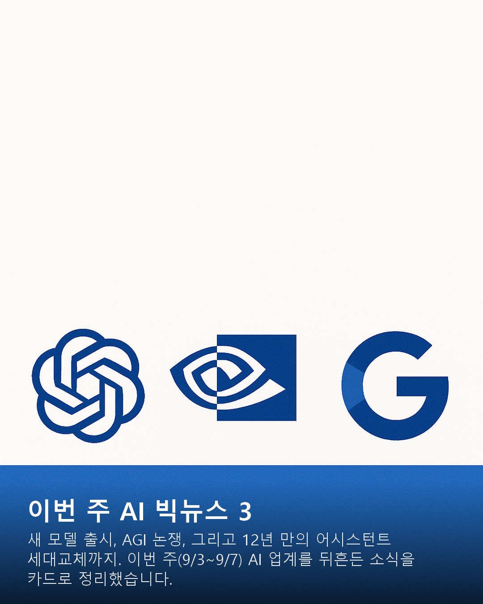
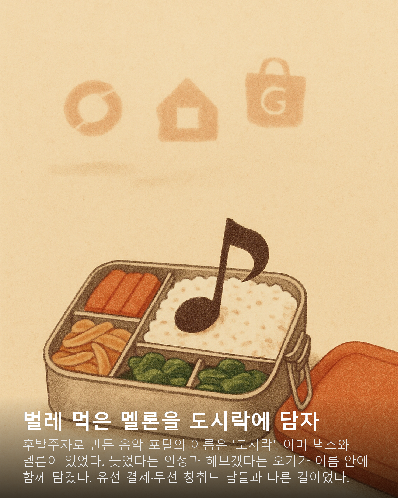
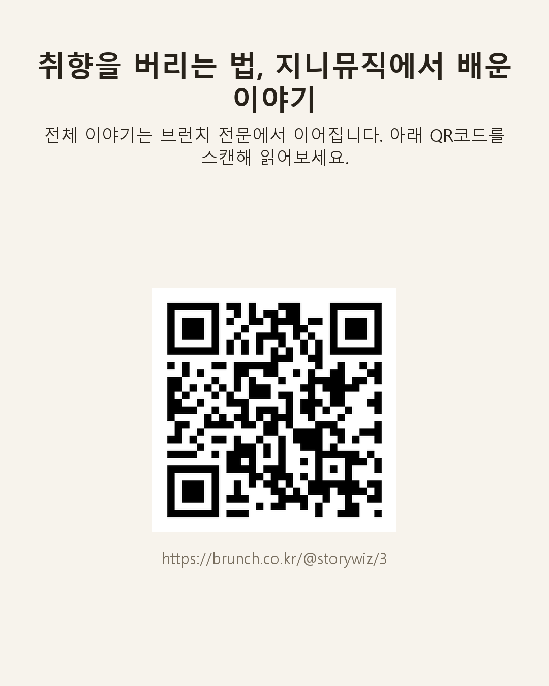

# card-news-agent

카드뉴스(인스타그램 캐러셀형 이미지+텍스트 포스트)를 사람-AI 협업 흐름으로 만드는 웹앱. N034 강의(`강의정리/N034/N034_카드뉴스에이전트(card-news-agent).md`)를 실습 삼아 만들었다.

이 저장소는 **두 프로젝트**를 담고 있다.

- **Project 1** — 강의를 충실히 따라 "AI 최신소식" 카드뉴스를 조사→후보선택→검증→스토리보드 승인→이미지 생성→검수→다운로드까지 완성
- **Project 2** — Project 1을 완주한 뒤, 같은 흐름을 "나만의 반복 업무"에 그대로 확장: **완성된 칼럼/에세이 원고 1편을 인스타그램 카드뉴스 8장으로 전환**하는 실전 워크플로(프로젝트 VOICE, 브런치 두 곳에 실제 적용)

실제로 배포하지 않았으므로, 아래에 **실제 생성된 결과물 이미지**를 그대로 붙여 GitHub에서 바로 확인할 수 있게 했다.

---

## 1. 구현 결과

```bash
uv sync --locked
uv run uvicorn app.main:app --reload --port 8765
```
브라우저에서 `http://127.0.0.1:8765` 접속. `.env`에 OpenAI 키 필요(`sk-proj-...`, 이미지 생성용). Claude CLI는 이 환경에 이미 인증돼 있으면 별도 설정 불필요.

### 현재 토픽 3개

| topic_id | 입력 | 용도 | 8번째 카드 |
|---|---|---|---|
| `ai_news` | 웹 조사 (WebSearch) | AI 최신소식 큐레이션 — **Project 1** | 일반 콘텐츠 카드 |
| `voice_column_cards` | 완성된 원고(`source_text`) | 프로젝트 VOICE 칼럼 → 인스타 카드 — **Project 2** | 일반 콘텐츠 카드 |
| `brunch_column_cards` | 완성된 원고 + 발행 URL(`source_text`+`source_url`) | 브런치 연재글 → 인스타 카드 — **Project 2** | **QR코드+URL 안내 카드로 자동 대체** |

---

## 2. PRD의 결정

전체 스펙은 [PRD.md](PRD.md), 선택 이유는 [DECISIONS.md](DECISIONS.md), 화면-서버 API 계약은 [API_SPEC.md](API_SPEC.md)에 있다. 핵심만 요약하면:

- **해결할 불편**: 카드뉴스(또는 칼럼→인스타카드 변환)처럼 "여러 후보를 조사·비교하고, 사람이 고르면, 그 선택대로 결과물을 만드는" 반복 작업을 사람이 매번 손으로 하고 있었음
- **기대 산출물**: 실제로 게시 가능한 1080×1350 카드 8장 + 캡션/해시태그, ZIP으로 다운로드
- **사람이 결정하는 지점**: (1) 후보/분할안 중 선택 (2) 스토리보드 승인 또는 수정 요청 (3) 실패한 카드만 개별 재생성 여부 (4) 완료 여부 — 그 외(조사 기간, 카드 수, 이미지 스타일 등)는 토픽 설정값으로 미리 정해두고 매번 다시 묻지 않음

---

## 3. 실행 증거

### Project 1 — AI 최신소식 카드뉴스 (강의 그대로)

실제 웹검색으로 AI 뉴스 후보 10개를 조사 → 2개 선택 → 심층 검증 → 8장 스토리보드 → 실제 이미지 생성까지 완주한 결과 중 2장:

 

### Project 2-A — 프로젝트 VOICE 칼럼 → 인스타 카드

VOICE(Making_Contents)의 실제 칼럼 원고 "벌레 먹은 멜론을 도시락에 담다"를 그대로 입력해 AI가 제안한 3가지 분할안(서사형/역피라미드형/귀납형) 중 하나를 골라 8장을 완성한 결과 중 2장(카드 4는 아래 "실패와 개선"에서 다루는 상표 로고 버그를 수정한 뒤의 버전):

 

### Project 2-B — 브런치 연재글 → 인스타 카드 (원문 링크 포함)

실제 발행된 브런치 글(`brunch.co.kr/@storywiz/3`, "개취를 버리는 일")을 입력해 7장의 내용 카드 + **QR코드로 원문에 연결되는 8번째 카드**까지 완성:

 

8번째 카드는 이미지 생성 API를 쓰지 않고 로컬에서 QR+URL만 합성해서, 실제로 다른 카드(~2MB)보다 파일 용량이 훨씬 작다(~67KB) — 스캔하면 실제 브런치 원문으로 연결된다.

---

## 4. 실패와 개선

인위적으로 실패를 만들지 않고, 실제로 개발 중 만난 두 가지 진짜 실패를 그대로 기록한다.

### 실패 1 — 예산 상한이 너무 낮아 첫 실행이 그대로 실패함 (Project 1)

- **증상**: `max_budget_usd=0.5`(달러)로 시작했더니, 실제 웹검색 기반 조사 작업 도중 예산을 초과해 첫 실행이 실패로 끝남
- **원인**: 실제 멀티턴 WebSearch 작업의 비용을 과소 추정함
- **바꾼 점**: 예산을 2.0달러로 올리고, 동시에 "예산초과/타임아웃처럼 재시도해도 반드시 다시 실패할 오류는 재시도하지 않는다"는 판단 로직(`_is_recoverable_by_reformat()`)을 추가함 — 처음엔 무조건 1회 재시도하게 돼 있어서, 예산초과 시 재시도가 예산을 두 배로 태우고도 또 실패하는 것까지 실제로 확인했기 때문
- **재실행 결과**: 이후 동일 토픽으로 실행 시 정상 완주 (Project 1 결과물 참고)

### 실패 2 — AI가 실제 상표(로고)를 그려냄 (Project 2-A)

- **증상**: VOICE 칼럼의 4번째 카드(image_role: "경쟁사 로고를 흐릿하게 표시")를 생성했더니, gpt-image-1이 원문(벅스·멜론)과 전혀 무관한 **실제 상표**(GrubHub·Uber Eats·DoorDash — 미국 배달앱)를 그려냄
- **원인**: "경쟁사 로고"라는 추상적 지시만으로는 모델이 무엇을 그려야 할지 몰라 학습 데이터에 흔한 실제 브랜드로 채워 넣음
- **바꾼 점**: 모든 토픽이 공유하는 이미지 생성 프롬프트(`app/image_gen.py`)에 "실제 브랜드명·로고·상표를 그리지 말 것"을 전역으로 추가함 — 이 토픽만이 아니라 전체 시스템의 안전장치로 격상
- **재실행 결과**: 같은 카드를 재생성 API로 다시 만들어 실제 상표가 사라지고 추상적인 아이콘으로 바뀐 것을 확인함(위 Project 2-A 이미지가 수정 후 결과)

### 아직 해결하지 못한 것

- 같은 답변을 빠르게 두 번 제출하는 경쟁 조건(race condition)은 상태머신 가드(`require_stage`)로 방어되긴 하지만, 실제로 초단위 동시 클릭을 재현해 테스트하지는 않음
- 6개 검수 기준(최신성·독자흐름·생성결과·가독성·실패재시도·내보내기)은 UI 체크리스트로만 존재하고, 완료 버튼을 막는 강제 게이트는 아님(의도적 설계 — [DECISIONS.md](DECISIONS.md) 참고)

---

## 5. Project 1 → Project 2 진행 과정

1. N034 강의 원문을 그대로 읽고, 7단계 워크플로·상태머신·DJ의 도구 설계 체크리스트를 그대로 적용해 `ai_news` 토픽으로 **Project 1**을 먼저 완성하고 실제 API로 끝까지 검증함(강의 이행 현황 대조표는 아래 참고)
2. Project 1이 실제로 동작하는 것을 확인한 뒤, 사용자의 실제 프로젝트 목록(POP_projectofprojects, 약 40개)을 조사해 카드뉴스 구조를 적용할 후보 3곳을 추리고, 그중 **프로젝트 VOICE**를 선택
3. VOICE의 기획서에 이미 있던 "M7 채널 파생(칼럼 1편→인스타 카드 8장)" 기능을, `TopicConfig`에 범용 필드(`tools`, `input_mode`) 2개만 추가해 구현 — 엔진 코드는 그대로 두고 "후보"와 "검증"의 의미만 토픽이 다르게 해석하게 만듦(자세한 설계는 [DECISIONS.md](DECISIONS.md))
4. VOICE 실제 칼럼으로 끝까지 완주하는 과정에서 실제 상표 로고 버그를 발견·수정함(위 "실패와 개선" 참고)
5. 사용자가 실제로 원했던 것을 다시 확인: "브런치 글을 넣으면 카드뉴스 8장을 만들고, 마지막 카드에 원문 URL을 넣어달라" → `cta_card` 필드 하나를 더 추가해 **brunch_column_cards** 토픽으로 구현
6. 실제 발행된 브런치 글로 끝까지 완주해 QR코드가 실제로 원문에 연결되는 것까지 확인 (**Project 2 완료**)

### 강의(N034) 이행 현황 — Project 1 대조표

"교재를 충실히 따랐는가"를 그냥 그렇다고 답하지 않고, 강의 원문의 각 지침과 실제 구현을 하나씩 대조했다.

**그대로 따른 것**

| 강의 지침 | 실제 구현 |
|---|---|
| 7단계 에이전틱 워크플로 (Ch1) | `research → await_selection → verify_storyboard → await_approval → generate_images → await_review → done` 그대로 구현 |
| PRD를 소스오브트루스로 바이브코딩 (Ch3) | `PRD.md`를 먼저 쓰고, "작게 구현→실행→관찰→수정" 반복으로 빌드 |
| 실행 엔진 하나만 선택 (Ch3/4) | Claude Agent SDK 하나만 선택, 나머지(CLI/OpenCode)는 설치도 안 함 |
| 세션 ID와 앱 상태 분리 저장 (Ch4) | `research_session_id`/`storyboard_session_id`를 `stage`·후보·스토리보드·이미지 상태와 별도 컬럼에 저장 |
| `waiting_for_user`는 정상 상태 (Ch4) | 상태머신의 핵심 원칙으로 그대로 채택 |
| 새로고침 vs 서버 재시작 구분 (Ch4) | 새로고침은 localStorage+폴링으로 복원, 서버 재시작은 `failed(interrupted by restart)`로 정리 — 둘 다 실제로 서버 프로세스를 강제 종료해 재현 테스트함 |
| 조사 7일→30일 확장, 후보 7~12개, 선택 1~3개, 스토리보드 5~8장 (Ch5) | 수치 그대로 구현, 실제 웹검색으로 후보 10개 조사되는 것 실증 |
| confirmed_facts/unconfirmed_claims/evidence_url 분리 검증 (Ch5) | 스키마로 강제, 실제 결과에서 후보당 5~7개 확인 사실 확보됨 |
| 텍스트 분리 편집, 최종 1080×1350 규격 (Ch5) | Pillow로 별도 텍스트 레이어 합성, 정확히 1080×1350 산출 |
| 검수 6개 기준 (Ch5) | 검수 화면 체크리스트로 반영 |
| Ch6 "나만의 워크플로로 확장하기" | **Project 2로 실제 완료** — 위 3~5절 참고 |

**의도적으로 다르게 하거나 건너뛴 것**

| 강의 지침 | 실제로 한 것 | 왜 |
|---|---|---|
| 제공된 Python 참고 구현(Claude CLI+Antigravity) 다운로드해서 실행·비교 | 안 함, 처음부터 직접 설계 | "주제를 하드코딩하지 않는다"는 요구사항이 참고 구현의 전제와 달라서 |
| "모의 데이터로 화면·API 먼저 연결" 후 실제 AI 연결 (Ch3) | 건너뜀 — 사전 조사를 충분히 한 뒤 바로 실제 연동 | 예산 버그가 났을 때도 로그·DB 직접 조회로 원인을 특정할 수 있었음(다른 방법으로 같은 목적 달성) |
| Antigravity로 이미지 생성, 원본 1024×1024 | OpenAI `gpt-image-1`, 원본 1024×1536 | Antigravity 미설치. gpt-image-1 지원 프리셋 중 세로형 선택 |
| `question_id`/`version`으로 중복 제출 방지 | 상태머신 가드(`require_stage`)로 대체 | 같은 목적, 다른 메커니즘. 경쟁 조건 실제 재현 테스트는 안 함(미검증, 위 "아직 해결 못한 것" 참고) |

---

## 데이터

`data/app.db`(SQLite, gitignored)에 런 상태가 저장된다. 앱을 재시작해도 진행 중이던 런은 복구되지 않고 `failed(interrupted by restart)`로 정리된다 — 재시도 버튼으로 이어갈 수 있다. 생성된 카드는 `data/runs/{run_id}/`에 저장되고(용량이 커서 gitignored — 위 "실행 증거" 이미지는 `docs/evidence/`에 별도 보관), `/media/{run_id}/...`로 서빙된다.

## 새 주제 추가하는 법

`app/engine.py`, `app/main.py`는 절대 수정하지 않는다.

1. `app/topics/새주제.py`에 `TopicConfig` 인스턴스를 하나 만든다 (`ai_news.py`=웹조사형, `voice_instagram_cards.py`/`brunch_column_cards.py`=원고입력형 참고)
2. `app/topics/registry.py`의 `TOPICS` dict에 한 줄 추가한다

`TopicConfig`의 범용 스위치: `input_mode`("web_research" | "source_text"), `tools`(허용 도구 목록), `cta_card`(마지막 카드를 QR+URL 카드로 바꿀지).

## 다음에 해볼 만한 것

- 브런치 다른 원고로 추가 실전 테스트, "AI 공부방법" 등 또 다른 topic 실제 추가
- 6개 검수 기준을 완료 버튼의 하드 게이트로 바꿀지 검토
- Restaurant-Reviews/GoodNews 쪽도 topic으로 추가 검토 (POP_projectofprojects 조사에서 후보로 나왔던 곳들)
- 중복 제출 경쟁 조건 실제 재현 테스트
