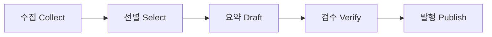
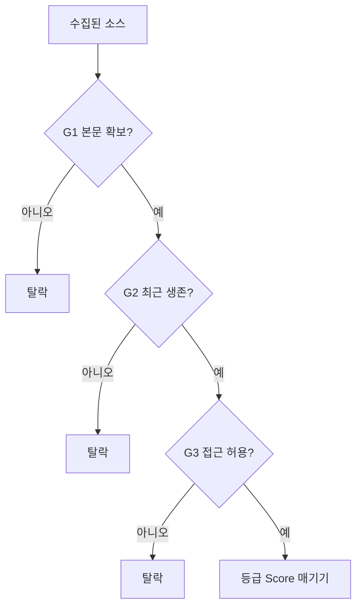
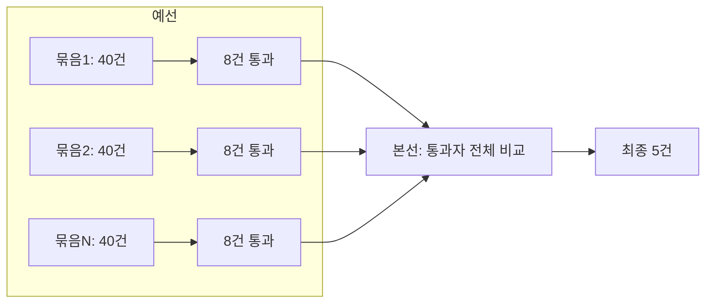

# N036 · 뉴스레터 에이전트 만들기 — 수집부터 발행까지

> **핵심 한 문장 요약**: 뉴스레터 자동화는 하나의 거대한 AI 마법이 아니라, "수집 → 선별 → 요약 → 검수 → 발행"이라는 5단계를 LangGraph의 State-Node로 명확히 쪼갠 뒤, 각 단계마다 "어디서는 사람이 정한 규칙(관문)을 쓰고 어디서는 AI 판단(등급)을 쓸지", "무엇을 숫자로 측정해서 감이 아니라 데이터로 판단할지"를 하나씩 결정해 나가는 설계 훈련이다.

---

## 목차

1. [뉴스레터 에이전트 — 수집부터 발행까지](#ch1)
2. [만드는 순서 정하기](#ch2)
3. [자료 수집 — 첫 번째로 정할 것](#ch3)
4. [자료 수집 — 소스 품질 측정·관문 세우기](#ch4)
5. [수집 노드 만들기](#ch5)
6. [중요한 소식 선정하기](#ch6)
7. [후보가 수백 건이 되면](#ch7)
8. [제목과 링크만 있는 상태](#ch8)
9. [요약이 원문을 벗어났는지 검사하기](#ch9)
10. [마지막 노드 — 발행](#ch10)
11. [자동 실행에 필요한 것](#ch11)
12. [내린 결정을 재보기](#ch12)
13. [구조와 내용 분리하기](#ch13)
14. [만든 것 (회고)](#ch14)
- [부록 A · 실전 코드 맛보기](#appendix-a)
- [부록 B · 트러블슈팅 표](#appendix-b)
- [부록 C · AI 프롬프트 모음집](#appendix-c)
- [부록 D · 용어 사전](#appendix-d)
- [부록 E · 개념 비교표 모음](#appendix-e)
- [부록 F · 학습 로드맵](#appendix-f)
- [부록 G · 복습 퀴즈](#appendix-g)

---

<a id="ch1"></a>
## 1. 뉴스레터 에이전트 — 수집부터 발행까지

이 강의는 지난 시간에 배운 LangGraph의 State-Node-Edge 틀과 Anthropic의 워크플로 패턴(체이닝·라우팅·병렬화·오케스트레이터-워커·평가자-최적화자)을 실제로 손에 잡히는 프로젝트 하나에 처음부터 끝까지 적용해 봅니다. 소재는 "AI 뉴스레터 자동 발행 시스템"입니다.

> **🧪 예제 (식당 비유, 원문 그대로)**: "예를 들어 식당에서 음식을 만드는 것과 비슷합니다.
> 재료 준비 → 좋은 재료 선별 → 요리 → 맛 검사 → 손님에게 제공
> 뉴스레터도 똑같습니다.
> 뉴스 가져오기 → 좋은 뉴스 고르기 → 요약하기 → 검사하기 → 독자에게 보내기"

이 다섯 단계를 LangGraph의 Node로 옮기면 각 단계가 "일을 하는 직원"이 됩니다.

> **🧪 예제 (Node=직원 비유, 원문 그대로)**: "Node란? 쉽게 말하면 일을 하는 작업자입니다. 예를 들어:
> 수집 Node → 뉴스를 가져오는 직원
> 선별 Node → 중요한 뉴스를 고르는 직원
> 요약 Node → 기사를 정리하는 직원
> 검수 Node → 결과를 검사하는 직원
> 발행 Node → 독자에게 보내는 직원"

강의는 이 다섯 직원을 실제로 채용(구현)하기 전에, 먼저 이런 질문을 던지며 시작합니다.

> **🧪 예제 (아이스브레이킹, 원문 그대로)**: "Q. [아이스브레이킹] 여러분이 매일 챙겨 보는 분야의 소식이 있다면 무엇인가요? 지금은 어떤 경로로 그 소식을 접하고 있고, 그 방법에서 가장 번거로운 점 한 가지는 무엇인가요?"

이 질문이 중요한 이유는, 뉴스레터 자동화가 풀어야 할 진짜 문제는 "AI가 글을 잘 쓰느냐"가 아니라 **"매일 쏟아지는 정보 중 진짜 중요한 것만 골라 믿을 만하게 전달하느냐"** 이기 때문입니다. 이 강의 전체는 그 질문에 답하기 위한 설계 결정들의 연속입니다.

전체 진행 순서는 다음과 같습니다: 섹션 1~2는 준비(순서 정하기), 3~5는 수집, 6~7은 선별, 8~9는 요약과 검수, 10은 발행, 11~12는 자동화와 관측, 13은 유지보수, 14는 회고입니다.

---

<a id="ch2"></a>
## 2. 만드는 순서 정하기

다섯 개의 Node를 만들 때 순서를 어떻게 정할지부터 결정이 필요합니다. 강의는 두 가지 선택지를 비교합니다.

> **🧪 예제 (원문 그대로)**: "① 부품을 다 만들고 마지막에 조립한다 / 수집·선별·요약·검수·발행 함수를 각각 완성한 뒤 마지막에 이어 붙입니다. 한 번에 한 가지만 생각하면 되고, 각 함수를 독립적으로 테스트하기 좋습니다. 대신 조립하는 날까지 도는 물건이 없습니다."

두 번째 선택지가 이 강의가 채택하는 방식입니다.

> **🧪 예제 (걷는 뼈대, 원문 그대로)**: "모든 단계를 아주 얇게 한 번씩 관통시켜 끝까지 도는 것을 먼저 만드는 방식입니다. 각 단계는 진짜 일을 하지 않고 다음으로 넘기기만 하죠."

이것이 **"걷는 뼈대(Walking Skeleton)"** 입니다. 다섯 노드를 전부 "받은 걸 그대로 다음으로 넘기기"만 하는 빈 껍데기로 먼저 이어 붙여서, 처음부터 끝까지 실제로 실행되는 흐름부터 확보합니다. 그다음 섹션마다 노드 하나씩 살을 채웁니다. 뼈대가 먼저 서 있으면 "지금 몇 % 완성됐다"가 아니라 "지금 이 상태로도 끝까지 돈다"는 확신을 매 순간 유지할 수 있습니다.

뼈대를 세우기 전에 먼저 정해야 하는 것이 다섯 직원이 공유할 **작업판(State)** 입니다.

> **🧪 예제 (공용 작업판 비유, 원문 그대로)**: "예를 들어 회사에서 뉴스레터를 만든다고 생각해보겠습니다. 책상 위에 이런 문서가 있습니다.
> ┌──────────────────────────┐
> │        뉴스 작업판       │
> ├──────────────────────────┤
> │ 수집된 기사               │
> │ 선정된 기사               │
> │ 작성된 요약               │
> │ 검수 결과                 │
> │ 실행 로그                 │
> └──────────────────────────┘
> 수집 담당자가 기사 목록을 올려놓으면, 선별 담당자가 그중 일부를 선택합니다. 그 다음 취재 담당자가 내용을 작성합니다. 검수 담당자가 확인합니다. 마지막으로 발행 담당자가 가져갑니다. 이 공용 작업판이 LangGraph의 State입니다."

State를 정의할 때 실무적으로 중요한 것이 **Reducer**(여러 값이 합쳐져야 하는 키에만 붙이는 병합 규칙)입니다. `drafted`(작성된 요약들)나 `log`(실행 로그)처럼 여러 노드가 계속 덧붙여야 하는 키에는 Reducer를 붙이고, 나머지 키는 그냥 마지막 값으로 덮어쓰게 둡니다. 모든 키에 Reducer를 붙이는 게 아니라 "합쳐야 하는 것에만" 붙인다는 절제가 핵심입니다.

> **💡 팁**: State는 티켓 규격서처럼 미리 정의해 두는 것이 좋습니다. 나중에 노드를 하나씩 채워갈 때, "이 노드가 State의 어떤 키를 읽고 어떤 키를 쓰는가"만 보면 그 노드의 책임 범위를 바로 알 수 있기 때문입니다.

---

<a id="ch3"></a>
## 3. 자료 수집 — 첫 번째로 정할 것

첫 번째로 채울 노드는 수집입니다. 그런데 코드를 짜기 전에 "어디서 뉴스를 가져올 것인가"부터 정해야 합니다. 강의는 이걸 다섯 칸짜리 사다리로 정리합니다.

> **🧪 예제 (사다리 비유, 원문 그대로)**: "아래 다섯 칸은 위로 갈수록 안전하고 아래로 갈수록 위험합니다. '사다리'라고 부르겠습니다. 위 칸이 가능하면 아래로 내려가지 않는 것이 원칙입니다."

| 단 | 방법 | 특징 |
|---|---|---|
| ① | 공식 API | 가장 안전. 제공자가 공식적으로 허용·관리 |
| ② | RSS/Atom | 표준 규격, 사이트가 자발적으로 제공, 안정적 |
| ③ | 공개 데이터셋 | 이미 정리된 정적 자료, 실시간성은 약함 |
| ④ | 서드파티 집계 서비스 | 남이 이미 모아둔 것을 재사용, 의존성이 하나 더 생김 |
| ⑤ | 직접 스크래핑 | 가장 위험. 대상 사이트의 구조 변경·차단에 취약 |

뉴스라는 소재의 특성상 이 강의는 **RSS/Atom(②)**을 기본 경로로 선택합니다. 대부분의 언론사·미디어가 RSS 피드를 공식 제공하고, 표준 규격이라 파싱이 안정적이기 때문입니다.

> **💡 팁**: 이 사다리는 "모든 소스에 하나의 방법만 쓰라"는 규칙이 아닙니다. Hacker News처럼 공식 API(①)가 있는 소스는 그쪽을 쓰고, 그렇지 않은 언론사는 RSS(②)를 쓰는 식으로 **소스마다 사다리에서 가장 위 칸을 골라 섞어 쓰는 것**이 원칙입니다.

---

<a id="ch4"></a>
## 4. 자료 수집 — 소스 품질 측정·관문 세우기

경로를 정했다고 끝이 아닙니다. 같은 RSS라도 소스마다 품질이 다릅니다. 이 강의가 강조하는 원칙은 "감으로 좋다/나쁘다를 정하지 말고, 실제로 측정한 숫자로 판단하라"는 것입니다. 실습에서는 소스 6곳을 놓고 각 소스에서 기사 3건씩을 가져와 건수·요약 길이·최신성을 직접 재봅니다.

여기서 두 가지 개념이 갈립니다.

- **tier(소스 등급)**: 1차 소스(당사자가 직접 발표, 예: 기업 공식 블로그)와 2차 소스(그걸 취재해서 다시 쓴 기사, 예: 언론사)를 구분합니다.
- **관문(Gate) vs 등급(Score)**: 강의는 이 둘을 엄격히 구분합니다.

> **🧪 예제 (관문 vs 등급, 원문 그대로)**: "1단계 Gate = 자격 심사, 2단계 Score = 경쟁 평가"

즉, 관문(G1 본문·G2 생존·G3 접근)을 먼저 통과시켜 "애초에 후보가 될 자격이 있는가"를 걸러내고, 그 관문을 통과한 것들끼리만 등급(score)을 매겨 우열을 가립니다. 자격 미달인 후보에게 굳이 정교한 점수를 매기느라 시간을 쓰지 않는다는 설계입니다.

- **G1 본문**: 본문 추출 시 요약 재료로 쓸 수 있는 길이(기준 600자)를 확보했는가
- **G2 생존**: 소스가 최근에도 실제로 업데이트되고 있는가(죽은 피드가 아닌가)
- **G3 접근**: 자동 수집이 허용된 대상인가(`robots.txt` 등으로 확인)

---

<a id="ch5"></a>
## 5. 수집 노드 만들기

여기서부터 뼈대의 첫 번째 노드(`collect`)에 실제 로직을 채웁니다. 핵심 로직 세 가지입니다.

- **시간창(hours) 필터**: 지정한 시간(예: 24시간) 이전 기사는 걸러냅니다. 실습에서는 6 / 24 / 72시간을 바꿔가며 결과가 어떻게 달라지는지 비교합니다.
- **URL 정규화로 중복 제거**: 같은 기사가 쿼리 파라미터만 다르게 붙어 중복 수집되는 것을 막습니다.
- **소스별 실패 격리**: 한 소스가 응답하지 않아도 전체 수집이 멈추지 않게 하고, 실패한 소스는 별도 로그(`dead`)에 기록합니다.

이 마지막 부분에서 이 챕터 전체를 관통하는 개념이 등장합니다.

> **🧪 예제 (조용한 실패, 원문 그대로)**: "실행이 멈추지도 않고 에러도 안 남기는데 결과만 틀리게 나오는 고장을 말합니다. ... 자동으로 도는 시스템에서 가장 비싼 고장입니다. 요란하게 죽는 건 그날 바로 고치지만, 조용한 고장은 몇 달 뒤 누군가 "요즘 왜 그 매체 기사가 안 보이지?"라고 물을 때까지 남아 있고, 그때는 몇 달치를 거슬러 올라가야 하거든요."

> **⚠️ 주의**: `except Exception: pass`나 `continue`로 조용히 넘어가면 실패의 증거 자체가 사라집니다. 소스 하나가 죽어도 전체 파이프라인은 계속 돌아야 하지만(격리), 그 실패는 반드시 어딘가에 기록으로 남아야 합니다(관측 가능성).

---

<a id="ch6"></a>
## 6. 중요한 소식 선정하기

수집된 기사 중 정말 중요한 것만 골라야 합니다. 가장 먼저 시도하는(그리고 실패하는) 방법은 "기사마다 1~10점을 매겨서 상위 5개를 뽑는다"는 **독립 채점(절대평가)** 방식입니다. 그런데 실제로 해보면 점수가 4~5개 값에만 몰려서 동점이 쏟아지고, "정확히 5건을 뽑는다"는 요구를 채점만으로는 풀 수 없다는 것이 드러납니다.

강의는 이걸 이렇게 재정의합니다: **"개수를 정확히 맞춰야 하는 문제는 채점(절대평가) 문제가 아니라 정렬(상대평가) 문제다."**

> **🧪 예제 (손흥민·이강인 비유, 원문 그대로)**: "사람에게도 익숙한 판단 방식입니다. 예를 들어: "손흥민과 이강인 중 오늘 뉴스에서 누가 더 중요한가?" 처럼 두 대상을 비교하는 것은 점수를 직접 부여하는 것보다 쉬울 수 있습니다."

절대평가와 상대평가를 비교하면 다음과 같습니다.

| 구분 | 절대평가(독립 채점) | 상대평가(비교) |
|---|---|---|
| 방식 | 기사 하나씩 점수를 매김 | 기사들을 서로 비교해 순위를 매김 |
| 강점 | 빠르고 병렬 처리하기 쉬움 | "정확히 N개"를 자연스럽게 만족 |
| 약점 | 동점 몰림, 개수 보장 안 됨 | 후보가 많아지면 비교 횟수 폭증 |

강의는 실제로 4가지 구조를 비교합니다: ① 독립 채점, ② 토너먼트(1:1 비교를 반복), ③ 전체 비교(모든 후보를 한 번에 놓고 비교), ④ 2단 상대평가(예선으로 추리고 본선에서 다시 비교). 후보 수가 적을 땐 ③이 간단하지만, 후보가 수백 건으로 늘어나면 한 번에 다 보여줄 수 없다는 문제에 부딪힙니다. 이 문제는 다음 챕터로 이어집니다.

---

<a id="ch7"></a>
## 7. 후보가 수백 건이 되면

수집된 기사가 하루 50~120건까지 늘어나면, 한 번의 LLM 호출에 전부 밀어넣고 비교시키기 어렵습니다(입력이 너무 길어지고, 결과의 일관성도 떨어집니다). 여기서 지난 강의에서 배운 **Sectioning(병렬화)** 패턴이 다시 등장합니다.

> **🧪 예제 (시험지 채점 선생님 비유, 원문 그대로)**: "예를 들어 100명의 학생에게 시험지를 한꺼번에 채점하게 하는 대신:
> 1~25번 → A 선생님
> 26~50번 → B 선생님
> 51~75번 → C 선생님
> 76~100번 → D 선생님
> 처럼 나눠 처리하는 것입니다."

이 강의에서는 후보를 40건씩 묶어 각 묶음(예선)에서 8건을 통과시키고, 통과자 전체를 모아 본선에서 다시 상대평가로 최종 5건을 추립니다. 이것이 6장에서 나온 "2단 상대평가(④)" 구조입니다.

이 방식에는 분명한 약점이 있습니다.

> **⚠️ 주의 (묶음 운, Batch Luck)**: 강한 후보들이 우연히 같은 예선 묶음에 몰리면, 정작 그 묶음에서는 탈락하고 다른 묶음의 상대적으로 약한 후보가 본선에 오를 수 있습니다. 이를 완화하려면 예선 통과 수(8건)를 최종 필요량(5건)보다 넉넉하게 잡아 여유를 둡니다.

또한 예선에서 "같은 사건을 다룬 여러 매체의 기사"가 중복으로 통과하지 않도록, LLM에게 응답 형식을 자유 문장이 아니라 정해진 스키마로 강제하는 **구조화 출력(Structured Output)**을 씁니다. `event`라는 필드에 "같은 사건이면 같은 라벨을 붙이라"는 설명을 넣어, 이후 코드에서 `Counter(p.event for p in finals)`로 중복 사건을 손쉽게 걸러낼 수 있게 합니다.

> **⚠️ 주의**: 구조화 출력은 필드가 "존재한다"는 것만 보장할 뿐, 그 안에 들어갈 값이 규칙(같은 사건에는 항상 같은 라벨)을 실제로 지켰는지는 보장하지 않습니다. 스키마를 믿고 검증을 생략하면 안 됩니다.

---

<a id="ch8"></a>
## 8. 제목과 링크만 있는 상태

본선까지 통과해 최종 선정된 기사도, 이 시점엔 아직 제목과 링크뿐입니다. 여기서부터 실제 취재(요약 작성)가 시작됩니다. 먼저 본문을 추출한 뒤, 출력을 세 칸으로 나눕니다.

- `headline`: 제목
- `summary`: 본문 요약
- `why`: 왜 중요한지에 대한 해설

세 칸으로 나누는 이유는 각 칸의 **검증 가능성**이 다르기 때문입니다. `summary`는 원문과 대조해 사실 확인이 가능하지만, `why`는 해석이 섞여 있어 같은 방식으로 검증하기 어렵습니다. 이렇게 성격이 다른 정보를 한 덩어리로 뭉쳐 놓으면 다음 단계(검수)에서 어디까지가 사실이고 어디부터가 해석인지 구분할 수 없게 됩니다.

작업 방식 면에서는, 기사 수만큼 요약을 동시에 만들어야 하므로 LangGraph의 `Send`로 기사 개수만큼 노드를 동적으로 띄우는 **Fan-out**을 씁니다(지난 강의의 오케스트레이터-워커 패턴과 같은 메커니즘입니다).

이 과정에서 실제로 발견된 문제가 있습니다.

> **⚠️ 주의**: 원문이 영어 기사인데 "한국어로 요약하라"고 시스템 프롬프트와 스키마 설명 두 곳에 명시해도, LLM이 원문의 언어를 따라가 영어로 응답하는 경우가 실제로 관찰되었습니다. 지시만으로는 부족해서, 코드로 `re.search(r'[가-힣]', out.summary)`처럼 한글 포함 여부를 검사한 뒤 실패하면 "반드시 한국어로 다시 쓰세요"라고 재요청하는 장치가 필요했습니다.

---

<a id="ch9"></a>
## 9. 요약이 원문을 벗어났는지 검사하기

요약이 다 만들어졌다고 끝이 아닙니다. LLM이 원문에 없는 내용을 지어내지(환각) 않았는지 검수해야 합니다. 가장 먼저 시도한 방법은 "요약에 등장한 숫자가 원문에도 있는지 문자열로 대조"하는 것이었는데, 실제로 돌려보니 오탐이 쏟아졌습니다.

> **🧪 예제 (실제 오탐 사례, 원문 수치 기반)**: 원문 "just three months after … raised $60 million"을 요약이 "지난 3개월 전 6000만 달러 규모의 투자 이후"라고 옮기자, 숫자 문자열 대조는 요약에 등장한 숫자 `['3','5','6000']` 중 원문에 없는 숫자 `['3','6000']`를 "근거 없음"이라 판정했습니다. 하지만 이는 환각이 아니라 `three months`→`3개월`, `$60 million`→`6000만 달러`처럼 정상적인 번역·단위 환산이었습니다.

이 사례는 **대조 방식 자체가 틀렸다**는 것을 보여줍니다. 문자열 대조 대신, "이 요약의 각 주장이 원문에서 실제로 뒷받침되는가"를 LLM에게 다시 판단시키는 **의미 기반 검수**로 전환합니다.

> **📌 요약**: "그래서 요약 품질의 문제처럼 보이지만 사실은 입력 데이터의 문제일 수 있습니다. 이것이 바로 Garbage In → Garbage Out의 대표적인 사례입니다."

검수 장치를 만든 뒤에도 끝이 아닙니다.

> **⚠️ 주의**: 검수에서 불합격이 한 건도 나오지 않는 상태가 계속된다면, 이것은 "품질이 완벽하다"는 좋은 신호가 아니라 "검수 장치가 실제로 작동하는지 확인이 필요하다"는 신호입니다. 일부러 틀린 요약(가짜 데이터)을 넣어 검수가 제대로 잡아내는지 주기적으로 테스트해야 합니다.

---

<a id="ch10"></a>
## 10. 마지막 노드 — 발행

검수를 통과한 콘텐츠를 실제로 독자에게 보냅니다. 발행 경로 후보는 네 가지입니다: 이메일 / Slack / Discord 웹훅 / 정적 페이지. 이 강의는 구현 속도를 우선해 **Discord 웹훅**을 선택합니다. 나중에 이메일 등으로 전환이 필요해지면 발행(`publish`) 노드만 교체하면 되고, 앞단 로직(수집·선별·요약·검수)은 그대로 재사용할 수 있다는 것이 이 설계의 장점입니다.

Discord embed 구조로 `headline`/`summary`/`why`/`url`을 카드 형태로 만들며, 다음 스펙을 지켜야 합니다.

| 항목 | 한도 |
|---|---|
| embed 개수 | 메시지당 10개 |
| embed 제목 | 256자 |
| embed 본문(description) | 4096자 |
| 메시지 전체 합계 | 6000자 |

발행은 되돌릴 수 없는 행동이므로, `dry_run` 기본값을 **발행 안 함**으로 둡니다. 예: `[dry-run] embed 3개 · 590자 — 보내지 않음`처럼 무엇이 나갈지만 미리 확인할 수 있게 합니다.

웹훅을 다루는 방식 자체에도 주의가 필요합니다.

> **🧪 예제 (웹훅 URL = 열쇠 비유, 원문 그대로)**: "어느 쪽이든 노트북에 주소를 적은 채로 공유하면 안 됩니다. 웹훅 URL에는 인증이 따로 없어서, 주소를 아는 사람은 누구나 그 채널에 글을 쓸 수 있어요. 아이디와 비밀번호가 아니라 주소 자체가 열쇠입니다."

HTTP 응답 코드로 성공 여부를 판단합니다: `204`(성공·본문없음, 정상) / `400`(JSON 형식 오류) / `401`·`404`(주소 오류·웹훅 삭제됨) / `429`(요청 한도 초과, Rate Limit).

---

<a id="ch11"></a>
## 11. 자동 실행에 필요한 것

지금까지는 노트북에서 사람이 직접 실행했습니다. 매일 자동으로 돌아가게 하려면 노트북을 `graph.py`(State·다섯 노드·`build()`·`run()`) / `run.py`(실행 진입점) / `requirements.txt`로 옮기고, API 키와 웹훅 URL은 코드에 직접 적지 않고 **GitHub Secrets**에 저장합니다.

실행 스케줄은 GitHub Actions로 관리합니다. 핵심 조합은 다음과 같습니다.

- **`schedule` (cron)**: 정해진 시각에 자동 실행. cron은 UTC 기준이라 KST 07:30은 `30 22 * * *`(전날 UTC 22:30)로 적습니다.
- **`workflow_dispatch`**: 필요할 때 사람이 손으로 즉시 실행할 수 있는 버튼.
- **`timeout-minutes`**: 멈춰버린 실행이 무한정 도는 것을 막는 안전장치(예: 20분).
- **`upload-artifact`**: 실행 로그가 사라지기 전에 파일로 남겨 보관.

> **⚠️ 주의**: cron으로 지정한 시각은 보장이 아니라 "최선의 노력"입니다. GitHub 인프라 상황에 따라 몇 분~한 시간 지연될 수 있습니다. 또한 공개 저장소라도 **60일간 커밋이 없으면 스케줄이 자동으로 정지**됩니다(메일로 통지되며 Actions 탭에서 재활성화 가능).

"자동으로 잘 돌고 있다"는 것을 확인하는 데는 세 겹의 안전장치(로그 확인, `dry_run`으로 사전 점검, `upload-artifact`로 기록 보관)가 필요하다고 강조합니다.

---

<a id="ch12"></a>
## 12. 내린 결정을 재보기

시스템이 자동으로 돌기 시작하면, 그 결과를 되짚어볼 수 있는 기록이 필요합니다. 매 실행마다 `store/metrics.jsonl`에 한 줄씩 기록을 남깁니다(형식: `json.dumps(row, ensure_ascii=False)`로 만든 뒤 파일에 append).

이 기록으로 **깔때기(Funnel) 관측**을 합니다: 수집(collected) → 예선 통과(picked) → 요약 완료(drafted) → 실제 발행(published) 개수를 나란히 놓고 보면, 어느 단계에서 후보가 얼마나 걸러지는지 한눈에 보입니다. 소스별 성적표(`by_source`)를 함께 남기면 "이 소스는 몇 주째 한 건도 통과 못 하고 있다"처럼, 겉으로는 멀쩡히 돌아가는 것 같지만 실제로는 죽어 있는 소스를 찾아낼 수 있습니다.

> **⚠️ 주의**: GitHub Actions는 실행마다 완전히 새로운 환경에서 시작됩니다. 로컬 컴퓨터와 달리, 그 실행 중에 `store/metrics.jsonl`에 쌓은 기록은 **실행이 끝나면 그 환경과 함께 사라집니다.** 기록이 누적되게 하려면 실행 마지막에 `git commit`으로 저장소에 직접 되커밋해야 합니다.

---

<a id="ch13"></a>
## 13. 구조와 내용 분리하기

시스템이 안정되면 유지보수 국면으로 넘어갑니다. 이 강의가 마지막으로 강조하는 설계 원칙은 "AI 뉴스"라는 **내용**(어떤 독자에게, 어떤 기준으로, 어떤 주제를 다룰지)과 "수집→선별→검수"라는 **구조**(그 판단을 실행하는 코드)를 분리하라는 것입니다.

> **🧪 예제 (주방과 메뉴 비유, 원문 그대로)**: "쉽게 비유하면 식당의 주방과 메뉴의 차이입니다.
> 구조 = 주방에서 음식을 만드는 방식
> 내용 = 오늘 판매하는 메뉴
> 주방의 조리 시스템은 그대로 두고 메뉴만 바꿀 수 있어야 합니다."

이걸 실제로 구현하는 방법이 `audience.yaml` 같은 별도 설정 파일입니다. 편집자(비개발자)가 이 파일만 고쳐도 코드를 건드리지 않고 뉴스레터의 독자·기준·토픽을 바꿀 수 있습니다.

무엇을 "내용"으로 분리해야 하는지 판단하는 기준은 다음 두 가지입니다.

- **분야가 바뀌면 이 값도 바뀌는가?** (예: "AI 뉴스"를 "금융 뉴스"로 바꾸면 중요도 기준도 달라진다 → 내용)
- **이걸 고칠 사람이 개발자인가, 편집자인가?** (개발자가 아니라 편집자가 고칠 값이라면 → 설정 파일로 분리)

---

<a id="ch14"></a>
## 14. 만든 것 (회고)

> **핵심 한 문장 요약 (재확인)**: 뉴스레터 자동화는 수집→선별→요약→검수→발행 5단계를 State-Node로 쪼갠 뒤, 각 단계에서 관문/등급, 절대평가/상대평가, 문자열 대조/의미 대조, 발행의 비가역성 같은 갈림길마다 근거 있는 선택을 하나씩 내려온 결과물이다.

이 강의를 통해 다음을 할 수 있게 되었습니다.

- 걷는 뼈대(Walking Skeleton) 방식으로 전체 파이프라인의 뼈대부터 세우고 단계별로 채울 수 있다
- 수집 경로를 사다리(공식API→RSS→데이터셋→집계→스크래핑)로 판단하고, 관문(Gate)과 등급(Score)을 구분해 소스 품질을 측정할 수 있다
- "개수를 정확히 맞춰야 하는 선정 문제"를 절대평가가 아니라 상대평가(예선/본선)로 재정의할 수 있다
- 검수 로직을 설계할 때 "무엇을 비교해야 하는가"(문자열이 아니라 의미)를 판단할 수 있다
- 자동 실행(GitHub Actions)과 관측(metrics 깔때기)까지 갖춘 실제 운영 가능한 시스템을 구성할 수 있다
- 구조와 내용을 분리해 유지보수 가능한 설정으로 만들 수 있다

강의가 명시적으로 **다루지 않은 것**도 있습니다: 정답 평가셋을 통한 회귀 검사, 발행 전 사람의 최종 승인 단계, 비용/모델 라우팅 최적화, 스크래핑(사다리 5단)으로의 확장. 이런 부분은 다음 단계의 과제로 남아 있습니다.

---

<a id="diagram-1"></a>
### 다이어그램 1 · 5단계 파이프라인



텍스트 버전: `수집 → 선별 → 요약 → 검수 → 발행`

### 다이어그램 2 · 관문(Gate) → 등급(Score) 판정 흐름



텍스트 버전: `소스 → [G1 본문] 미달시 탈락 → [G2 생존] 미달시 탈락 → [G3 접근] 미달시 탈락 → 통과분만 등급(score) 매기기`

### 다이어그램 3 · 예선/본선 2단 상대평가



텍스트 버전: `묶음별 예선(40건→8건 통과) → 통과자를 모아 본선(전체 상대평가) → 최종 5건`

---

<a id="appendix-a"></a>
## 부록 A · 실전 코드 맛보기

**1) 저장소 구조**
```
my-newsletter/
├── graph.py                # State · 노드 다섯 개 · build() · run()
├── run.py                  # graph.py 를 불러 한 번 실행한다 — 열 줄 남짓
├── requirements.txt        # feedparser · requests · trafilatura · openai · langgraph · pydantic
├── store/                  # 실행 기록이 쌓이는 곳
└── .github/workflows/daily.yml
```

**2) `run.py` 전문**
```python
# run.py
import os, sys
from graph import run   # graph.py 에 있는 그 run()
if __name__ == "__main__":
    if "--dry-run" in sys.argv:
        os.environ["DRY_RUN"] = "1"   # 섹션 10의 스위치
    out = run()
    for line in out["log"]:
        print(line)  # 이 출력이 Actions 로그에 그대로 남는다
```

**3) GitHub Actions 워크플로 (`.github/workflows/daily.yml`)**
```yaml
name: 매일 브리핑
on:
  schedule:
    - cron: "30 22 * * *"   # ① UTC 22:30 = KST 07:30
  workflow_dispatch:         # ② 손으로도 돌릴 수 있게
    inputs:
      dry_run:
        description: "발행하지 않고 로그만 남기기"
        type: boolean
        default: false
jobs:
  publish:
    runs-on: ubuntu-latest
    timeout-minutes: 20      # ③ 멈춰 있는 실행을 20분에서 끊는다
    steps:
      - uses: actions/checkout@v4
      - uses: actions/setup-python@v5
        with:
          python-version: "3.12"
          cache: pip
      - run: pip install -r requirements.txt
      - name: 브리핑 생성·발행
        run: python run.py ${{ inputs.dry_run && '--dry-run' || '' }}
        env:                  # ④ 비밀값은 여기로만 들어간다
          OPENAI_API_KEY:      ${{ secrets.OPENAI_API_KEY }}
          DISCORD_WEBHOOK_URL: ${{ secrets.DISCORD_WEBHOOK_URL }}
          TZ: Asia/Seoul
      - name: 실행 기록 보관   # ⑤ 로그 말고 파일로 남은 것도 챙긴다
        if: always()
        uses: actions/upload-artifact@v4
        with:
          name: run-${{ github.run_number }}
          path: store/
          retention-days: 30
```

**4) metrics 되커밋 스텝**
```yaml
permissions:
  contents: write   # 저장소에 쓰려면 필요하다
jobs:
  publish:
    steps:
      # ... 앞은 그대로 ...
      - name: 기록 커밋
        if: ${{ !inputs.dry_run }}
        run: |
          git config user.name  "newsroom-bot"
          git config user.email "bot@users.noreply.github.com"
          git add store/
          git diff --cached --quiet || (git commit -m "metrics: $(date +%F)" && git push)
```

**5) `audience.yaml` — 구조와 내용을 분리하는 설정 파일**
```yaml
독자:
  누구: "AI를 실제 제품에 붙이는 국내 개발팀 — 개발자와 기획자"
  이미_아는_것: "LLM API 사용법, 프롬프트 기본, RAG 개념"

# 본선 프롬프트에 그대로 들어간다. 위에 있을수록 우선.
# 기사 하나를 보고 예/아니오로 답할 수 있는 질문이어야 한다.
중요도_기준:
  - "이번 주 우리가 일하는 방식이 바뀔 만한가"
  - "지금 쓰는 도구·API의 가격·한도·정책이 실제로 변했나"

# 추상어("홍보성") 말고 구체적인 표현으로.
버릴_것:
  - "발표 예정·로드맵만 있고 지금 쓸 수 없는 것"
  - "MOU·업무협약·투자유치·수상 등 당사자 홍보성 소식"

토픽:
  - 이름: "모델·API"
    데스크지침: "가격·컨텍스트 길이·요청 한도 변화를 반드시 숫자로 적을 것"
  - 이름: "정책·규제"
    데스크지침: "규제 대상과 시행 시점을 반드시. 국내 적용 여부도"
```

**6) 핵심 인라인 코드 조각**

| 목적 | 코드 |
|---|---|
| 시간창 필터 | `if not at or at < cutoff` |
| URL 중복 제거 | `key = e.link.split("?")[0]` |
| 실패 격리 | `except Exception: dead.append(name)` |
| 노드를 이름으로 조회 | `globals()[name]` |
| 한글 포함 검사 | `re.search(r'[가-힣]', out.summary)` |
| 같은 사건 중복 카운트 | `Counter(p.event for p in finals)` |
| robots.txt 확인 | `RobotFileParser().can_fetch('*', url)` |
| 검수 결과 스키마 | `{ok: bool, problems: list[str]}` |
| metrics 한 줄 기록 | `with open(path, "a") as f: f.write(json.dumps(row, ensure_ascii=False) + "\n")` |

**7) 정확한 수치·스펙 총정리**

| 항목 | 값 |
|---|---|
| RSS/API 소스 수 | 11곳 (TechCrunch, The Verge, OpenAI/DeepMind 블로그, AI타임스, 전자신문, Hacker News 등) |
| 24시간 기준 수집 건수 | 50~120건 |
| 예선 묶음 크기 | 40건 (섹션 4 실습에서는 소스 6곳/기사 3건씩 측정) |
| 예선 묶음당 통과 수 | 8건 |
| 본선 최종 발행 목표 | 최대 5건 |
| G1 본문 관문 기준 길이 | 600자 |
| 예선 통과 대비 최종 발행 비율(정상 범위) | 약 1/3(33%) 안팎 |
| hours(시간창) 실험값 | 6 / 24 / 72시간 |
| 토너먼트 호출 횟수 공식 | n×(n-1)/2 → 12건=66번, 100건=4,950번 |
| Discord embed 한도 | embed 10개 / 제목 256자 / 본문 4096자 / 메시지 합계 6000자 |
| HTTP 상태 코드 | 204=성공 / 400=JSON 오류 / 401·404=주소오류 / 429=요청한도 |
| cron 표현식 | `30 22 * * *` (UTC 22:30 = KST 07:30) |
| GitHub Actions 자동 정지 | 60일 커밋 없으면 스케줄 자동 중단 |
| color 예시 | `0x0B6E77` → 10진수 `749175` (embed color는 정수) |
| dry-run 출력 예시 | `[dry-run] embed 3개 · 590자 — 보내지 않음` |

---

<a id="appendix-b"></a>
## 부록 B · 트러블슈팅 표

| 증상 | 원인 | 해결 |
|---|---|---|
| 에러 없이 결과만 조용히 틀림(조용한 실패) | `except: pass`/`continue`로 실패를 증거 없이 넘김 | 결과를 바꾸는 실패(소스 다운 등)는 반드시 로그(`dead`)에 남긴다 |
| "5건 뽑기"인데 점수가 4~5개 값에만 몰려 동점 다발 | 1~10점 독립 채점(절대평가)으로 정확한 개수를 강제하려 함 | 개수 고정 문제는 정렬(상대평가) 문제로 재정의 — 예선/본선 2단 구조 채택 |
| 영어 원문 기사인데 한국어 요약 요청에도 영어로 응답 | 시스템 프롬프트·스키마에 "한국어"를 명시해도 LLM이 입력 언어를 강하게 따라감 | 코드로 `re.search(r'[가-힣]', ...)` 검사 후 실패 시 "반드시 한국어로 다시 쓰세요" 재요청 |
| 정상적인 번역/단위환산을 환각으로 오판 (`three months`→`3개월`, `$60 million`→`6000만 달러`) | 요약-원문 숫자를 문자열로 단순 대조 | 의미 기반(LLM) 대조로 전환 — "각 주장이 원문에서 뒷받침되는가"를 판단시킴 |
| 구조화 출력을 썼는데도 같은 사건이 중복으로 통과 | 스키마는 필드 존재만 보장하지 내용 규칙 준수는 보장 안 함 | `event` 필드에 "같은 사건이면 같은 라벨"을 지시하고 코드로 `Counter`로 재검증 |
| 강한 후보가 예선에서 먼저 탈락(묶음 운) | 강한 후보들이 우연히 같은 예선 묶음에 몰림 | 예선 통과 수(8건)를 최종 필요량(5건)보다 넉넉히 잡아 여유 확보 |
| 겉보기엔 정상 실행됐는데 결과가 이상함 | 팬아웃 경계를 잘못 설계 — "TOP5 고르기"가 "기사 하나가 중요한가"로 변질 | 비교가 필요한 단계는 펼치지 말고 모아서 처리(팬아웃 경계 재검토) |
| 검수에서 불합격이 계속 0건 | 좋은 신호가 아니라 검수 장치 자체가 무력화됐을 가능성 | 일부러 틀린 데이터(가짜 요약)를 넣어 검수가 실제로 잡는지 주기적으로 테스트 |
| 웹훅 URL이 코드/공개 저장소에 노출됨 | 주소 자체가 인증 수단인데 노트북·커밋에 그대로 남김 | 즉시 삭제 후 재발급(이미 커밋된 값은 히스토리에 남으므로 삭제만으론 부족) |
| 매일 예약 실행이 몇 분~한 시간씩 늦음 | cron 실행 시각은 보장이 아니라 "최선의 노력" | 정시 실행이 필수라면 별도 모니터링/알림을 추가로 설계 |
| store/metrics.jsonl 기록이 다음 실행에서 안 보임 | GitHub Actions 환경은 실행마다 새로 생성되어 이전 파일이 사라짐 | 실행 끝에 `git commit`으로 저장소에 되커밋해야 누적됨 |
| 60일 지나니 스케줄이 저절로 꺼짐 | 저장소에 커밋이 없으면 GitHub가 schedule을 자동 중단 | 메일 통지 확인 후 Actions 탭에서 재활성화, 정기적으로 최소한의 커밋 유지 |

---

<a id="appendix-c"></a>
## 부록 C · AI 프롬프트 모음집

**선정(선별) 단계 — 나쁜 질문 vs 좋은 질문**

> - 나쁜 질문: "기사의 중요도를 1~10점으로 평가하세요."
> - 더 좋은 질문: "오늘 수집된 기사 중 가장 중요한 5개를 순위대로 선정하세요."
> - 가장 좋은 질문: "오늘 수집된 기사 중 가장 중요한 5개를 선정하세요. 동일한 사건을 다룬 기사는 하나만 선택하세요."

**예선/본선 중복 방지 지시**
> "같은 사건을 다룬 기사는 하나만 고르세요."

**구조화 출력 스키마 설명(필드 description)**
> `event` 필드: "같은 사건이면 같은 라벨"

**한국어 강제 재요청**
> "반드시 한국어로 다시 쓰세요"

**요약 검수 질문**
> "이 요약이 원문에서 뒷받침되는가" / "요약의 각 주장이 원문에서 뒷받침되는가"

**why 필드 설계 지침**
> "새로운 사실을 추가하지 말고 요약에 있는 내용만 근거로 삼으라"

**시스템 프롬프트 시작 문구**
> `SYS = "당신은 국내 개발팀을 위한..."`

**audience.yaml 안 설정 작성 규칙(그 자체로 프롬프트 설계 지침)**
> - "기사 하나를 보고 예/아니오로 답할 수 있는 질문이어야 한다"
> - "추상어("홍보성") 말고 구체적인 표현으로"
> - "위에 있을수록 우선"

---

<a id="appendix-d"></a>
## 부록 D · 용어 사전

### 알파벳순

| 용어 | 정의 |
|---|---|
| Dry Run | 실제로 보내지 않고 무엇을 보낼지만 확인하는 모드 |
| Fan-out / Send | LangGraph에서 조건부 엣지가 Send 리스트를 반환하면 개수만큼 같은 노드를 동적으로 띄우는 기능 |
| G1 / G2 / G3 관문 | G1 본문(요약 재료 확보), G2 생존(최근 업데이트 여부), G3 접근(자동수집 허용 여부) |
| Node | 하나의 업무 단계를 담당하는 작업 단위(함수) |
| Reducer | 여러 노드가 같은 State 키에 값을 쓸 때 합치는 규칙 (예: `operator.add`) |
| Sectioning(병렬화) | 입력을 나눠 동시에 처리하고 결과를 하나로 합치는 워크플로 패턴 |
| State | 노드 간 이동하는 공용 작업 공간(공용 작업판) |
| Structured Output(구조화 출력) | 모델 응답을 스키마(pydantic)로 강제해서 받는 기능 |
| Tier | 1차 소스(당사자 발표)와 2차 소스(취재기사)를 구분하는 소스 등급 |
| Walking Skeleton(걷는 뼈대) | 처음부터 끝까지 얇게라도 실제로 실행되는 최소 전체 구조 |
| Webhook(웹훅) | 미리 받아 둔 URL로 HTTP 요청을 보내면 상대 시스템에 정해진 일이 일어나는 연동 방식 |
| workflow_dispatch | GitHub Actions에서 사람이 수동으로 즉시 실행할 수 있게 하는 트리거 |

### 가나다순

| 용어 | 정의 |
|---|---|
| 관측(Observability) | 자동화 시스템이 멈춰도 티가 나도록 실행 여부·결과를 남기는 것 |
| 깔때기(Funnel) 관측 | 수집→예선→본선→발행처럼 단계별 개수/비율을 나란히 기록해 병목을 찾는 방법 |
| 등급(Score) | 관문을 통과한 것들 사이의 우열 |
| 묶음 운(Batch Luck) | 강한 후보가 같은 묶음에 몰려 다른 묶음의 약한 후보보다 먼저 탈락하는 현상 |
| 사다리(수집 경로 5칸) | 공식API→RSS/Atom→공개데이터셋→서드파티집계→직접스크래핑, 위칸 우선 원칙 |
| 실행 성공 vs 작업 성공 | 프로그램이 오류 없이 끝난 것과 실제 업무 목적이 달성된 것의 구분 |
| 예선/본선(2단 상대평가) | 후보를 묶음으로 나눠 1차 압축(예선) 후 통과자만 다시 비교(본선) |
| 절대평가 vs 상대평가 | 대상 하나를 척도로 채점 vs 여러 대상을 함께 놓고 비교해 순위 결정 |
| 조용한 실패(Silent Failure) | 프로그램은 정상 종료됐지만 결과가 틀린 상태 |
| 팬아웃 경계 | "다른 항목을 봐야 답할 수 있는가"로 모아서 처리할지 펼쳐 처리할지 가르는 기준선 |
| 평가자-최적화자 패턴 | 생성 결과를 평가자가 판정하고 불합격 시 재작성하는 패턴(이 강의는 재작성 대신 폐기 선택) |
| 관문(Gate) | 통과하지 못하면 나머지를 볼 필요 없는 자격 심사 기준 |

---

<a id="appendix-e"></a>
## 부록 E · 개념 비교표 모음

**1) 관문(Gate) vs 등급(Score)**

| 구분 | 관문(Gate) | 등급(Score) |
|---|---|---|
| 목적 | 자격 심사 — 통과/탈락만 결정 | 경쟁 평가 — 통과자끼리 우열 매김 |
| 적용 시점 | 후보 전체에 먼저 적용 | 관문을 통과한 후보에만 적용 |
| 예시 | G1 본문·G2 생존·G3 접근 | 상대평가로 매기는 중요도 순위 |

**2) 절대평가 vs 상대평가**

| 구분 | 절대평가(독립 채점) | 상대평가(비교) |
|---|---|---|
| 방식 | 기사 하나씩 점수 부여 | 여러 기사를 함께 놓고 비교 |
| "정확히 N개" 보장 | 어려움(동점 몰림) | 자연스럽게 만족 |
| 확장성 | 병렬 처리 쉬움 | 후보가 늘면 비교 횟수 급증 |

**3) 예선/본선(2단 상대평가) vs 전체 비교**

| 구분 | 전체 비교 | 예선/본선 |
|---|---|---|
| 적합한 후보 수 | 적을 때(한 번에 다 보여줄 수 있음) | 많을 때(수백 건 이상) |
| 약점 | 후보가 많아지면 입력이 너무 커짐 | 묶음 운(강한 후보가 먼저 탈락 가능) |

**4) 문자열 대조 vs 의미(LLM) 대조**

| 구분 | 문자열 대조 | 의미 기반 대조 |
|---|---|---|
| 방법 | 숫자·단어가 원문에 그대로 있는지 확인 | LLM이 "주장이 원문에서 뒷받침되는가"를 판단 |
| 약점 | 정상 번역/단위환산도 오탐으로 잡음 | 추가 LLM 호출 비용 발생 |

**5) 구조(주방) vs 내용(메뉴)**

| 구분 | 구조 | 내용 |
|---|---|---|
| 비유 | 주방의 조리 시스템 | 오늘 판매하는 메뉴 |
| 실제 예 | 수집→선별→검수 파이프라인 코드 | `audience.yaml`의 독자·기준·토픽 |
| 고치는 사람 | 개발자 | 편집자(비개발자) |

**6) 실행 성공 vs 작업 성공**

| 구분 | 실행 성공 | 작업 성공 |
|---|---|---|
| 의미 | 프로그램이 에러 없이 끝남 | 실제 업무 목적이 달성됨 |
| 함정 | 조용한 실패·팬아웃 경계 오설계 시 실행은 성공해도 결과가 틀릴 수 있음 | 매 단계 관측(로그·metrics)으로만 확인 가능 |

---

<a id="appendix-f"></a>
## 부록 F · 학습 로드맵

**이 강의로 할 수 있게 된 것**
- 다섯 단계 업무를 State-Node 파이프라인으로 설계하고 걷는 뼈대부터 세울 수 있다
- 소스 품질을 관문/등급으로 나눠 측정 기반으로 판단할 수 있다
- "개수 고정" 선정 문제를 절대평가가 아니라 상대평가(예선/본선)로 재정의할 수 있다
- 검수 로직에서 "무엇을 비교할지"(문자열 vs 의미)를 판단할 수 있다
- GitHub Actions로 자동 실행·비밀값 관리·관측(metrics)까지 갖춘 운영 가능한 시스템을 만들 수 있다
- 구조와 내용을 분리해 비개발자도 유지보수할 수 있는 설정을 설계할 수 있다

**다음에 배우면 좋은 것**
- 평가셋(정답 세트)을 만들어 회귀 검사(코드를 바꿔도 품질이 떨어지지 않았는지 자동 확인)하는 방법
- 발행 전 사람이 최종 승인하는 Human-in-the-loop 단계 추가
- 비용/모델 라우팅 최적화(쉬운 판단은 저렴한 모델, 어려운 판단만 고급 모델로)
- 사다리 5단(직접 스크래핑)까지 확장할 때 필요한 안전장치와 법적/윤리적 고려사항

---

<a id="appendix-g"></a>
## 부록 G · 복습 퀴즈

<details>
<summary>Q1. "걷는 뼈대(Walking Skeleton)" 방식이 "부품을 각각 완성 후 조립"하는 방식보다 나은 점은 무엇인가?</summary>

처음부터 끝까지 실제로 실행되는 흐름을 먼저 확보하기 때문에, 개발 중 어느 시점에서도 "지금 이 상태로 끝까지 도는가"를 바로 확인할 수 있다. 반면 부품을 각각 완성하는 방식은 조립하는 날까지 돌아가는 물건이 없다.
</details>

<details>
<summary>Q2. State에 Reducer를 "모든 키"가 아니라 "일부 키"에만 붙이는 이유는?</summary>

여러 노드가 값을 계속 덧붙여야 하는 키(예: drafted, log)에만 병합 규칙이 필요하고, 나머지 키는 마지막 값으로 덮어쓰는 것이 자연스럽기 때문이다. 모든 키에 Reducer를 붙이면 불필요하게 복잡해진다.
</details>

<details>
<summary>Q3. 뉴스 수집에 RSS/Atom을 기본으로 쓰면서도 Hacker News는 API를 쓰는 이유는?</summary>

수집 경로 사다리는 "하나의 방법만 쓰라"는 규칙이 아니라 "소스마다 사다리에서 가장 위 칸(더 안전한 방법)을 고르라"는 원칙이기 때문이다. Hacker News는 공식 API(①)가 있으므로 그쪽을 우선한다.
</details>

<details>
<summary>Q4. 관문(Gate)과 등급(Score)을 나눠서 적용하는 이유는?</summary>

자격 미달인 후보(관문 탈락)에게까지 정교한 우열 판단(등급)을 매기는 것은 낭비이기 때문이다. 먼저 관문으로 자격 있는 후보만 추리고, 그 후보들 사이에서만 등급을 매긴다.
</details>

<details>
<summary>Q5. "5건을 정확히 뽑아야 한다"는 요구를 절대평가(1~10점 채점)로 풀기 어려운 이유는?</summary>

점수가 소수의 값에만 몰려 동점이 다수 발생하기 때문에, "정확히 5건"이라는 개수 제약을 채점만으로는 만족시킬 수 없다. 이 문제는 채점(절대평가) 문제가 아니라 정렬(상대평가) 문제로 재정의해야 한다.
</details>

<details>
<summary>Q6. 예선(묶음 40건→8건 통과)에서 "묶음 운"이란 무엇이고 어떻게 완화하는가?</summary>

강한 후보들이 우연히 같은 예선 묶음에 몰려 정작 그 묶음 안에서 탈락하고, 다른 묶음의 상대적으로 약한 후보가 본선에 오르는 현상이다. 예선 통과 수(8건)를 최종 필요량(5건)보다 넉넉히 잡아 완화한다.
</details>

<details>
<summary>Q7. headline/summary/why를 한 덩어리가 아니라 세 칸으로 나누는 이유는?</summary>

각 칸의 검증 가능성이 다르기 때문이다. summary는 원문과 대조해 사실 확인이 가능하지만 why는 해석이 섞여 있어 같은 방식으로 검증하기 어렵다. 나눠 두면 다음 단계(검수)에서 사실과 해석을 구분해 다룰 수 있다.
</details>

<details>
<summary>Q8. 요약-원문 검수를 "숫자 문자열 대조"에서 "의미(LLM) 대조"로 바꾼 이유는?</summary>

정상적인 번역·단위 환산(예: three months→3개월, $60 million→6000만 달러)까지 문자열 대조가 환각으로 오판했기 때문이다. "주장이 원문에서 뒷받침되는가"를 의미 단위로 판단해야 이런 오탐을 피할 수 있다.
</details>

<details>
<summary>Q9. 검수에서 불합격이 계속 0건일 때 왜 안심하면 안 되는가?</summary>

품질이 완벽해서가 아니라 검수 장치 자체가 무력화됐을 가능성이 있기 때문이다. 일부러 틀린 데이터를 넣어 검수가 실제로 잡아내는지 주기적으로 테스트해야 한다.
</details>

<details>
<summary>Q10. GitHub Actions에서 store/metrics.jsonl 기록이 다음 실행에 이어지지 않는 이유와 해결책은?</summary>

Actions 실행 환경은 매번 새로 생성되어 이전 실행에서 쌓인 파일이 함께 사라지기 때문이다. 실행이 끝나기 전에 `git commit`으로 저장소에 되커밋해야 기록이 누적된다.
</details>

<details>
<summary>Q11. audience.yaml처럼 설정 파일로 분리할 값인지 판단하는 두 가지 기준은?</summary>

① 분야가 바뀌면 이 값도 바뀌는가(내용에 가까움), ② 이 값을 고칠 사람이 개발자가 아니라 편집자인가. 둘 중 해당되면 코드가 아니라 설정 파일로 분리한다.
</details>

<details>
<summary>Q12. Discord 웹훅을 발행 경로로 선택하면서도 "발행 노드만 교체하면 된다"고 말할 수 있는 이유는?</summary>

State-Node 구조에서 발행(publish)은 별도의 노드로 분리되어 있어, 앞단(수집·선별·요약·검수) 로직을 전혀 건드리지 않고 발행 노드 하나만 이메일 등 다른 경로로 교체할 수 있기 때문이다.
</details>

---

## 결론

뉴스레터 에이전트는 "AI가 알아서 글을 써주는 마법 상자"가 아니라, 수집→선별→요약→검수→발행이라는 다섯 개의 명확한 책임으로 쪼갠 파이프라인이며, 각 단계마다 "관문과 등급 중 무엇을 쓸지", "절대평가와 상대평가 중 무엇이 맞는지", "문자열을 비교할지 의미를 비교할지", "무엇을 코드에 두고 무엇을 설정 파일로 분리할지" 같은 구체적인 설계 결정을 하나씩 쌓아 올린 결과물이다. 이 강의가 반복해서 보여주는 태도는 "감이 아니라 측정으로 판단하고, 조용히 실패하지 않게 관측 장치를 반드시 남긴다"는 것이다.
