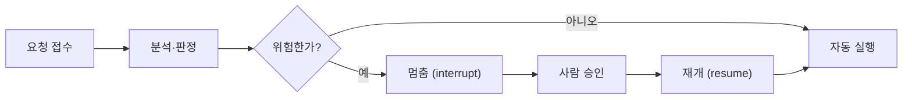

# N044 · 사람이 승인하는 에이전트 만들기 (HITL)

> 지금까지 만든 자동화는 "결과물을 만드는 것"까지만 했습니다. 이번 강의는 그 결과물을 **실제로 내보내는 마지막 한 걸음**에 사람의 승인을 끼워 넣는 방법을 다룹니다.

## 목차
1. [왜 사람이 봐야 하는가](#ch1)
2. [멈췄다 이어가는 구조](#ch2)
3. [멈춤 기준 정하기](#ch3)
4. [10초 안에 판단하는 승인 화면](#ch4)
5. [프로젝트: 사람이 승인하는 에이전트 만들기](#ch5)
6. [핵심 한 문장 요약](#summary)
- [부록 A · 실전 코드 맛보기](#app-a)
- [부록 B · 트러블슈팅](#app-b)
- [부록 C · AI 프롬프트 모음집](#app-c)
- [부록 D · 용어 사전](#app-d)
- [부록 E · 개념 비교표 모음](#app-e)
- [부록 F · 학습 로드맵](#app-f)
- [부록 G · 복습 퀴즈](#app-g)

---

<a id="ch1"></a>
## 1. 왜 사람이 봐야 하는가

지금까지 만들어 온 자동화는 "수집 → 분류 → 조사 → 결과물 생성"까지였습니다. 정확도를 아무리 끌어올려도, 그 결과물을 **되돌릴 수 없는 형태로 내보내는 순간**은 여전히 위험합니다.

> 💡 **팁**: "정확도가 95%인 AI에게 하루 200건을 맡기면 매일 10건이 확인 없이 잘못 나갑니다. 정확도를 99%까지 끌어올려도 하루 2건은 남습니다." — 정확도를 올리는 것과 안전한 것은 다른 문제입니다.

이 문제 앞에서 우리가 고를 수 있는 선택지는 셋뿐입니다.

| 선택지 | 장점 | 단점 |
|---|---|---|
| 전부 사람이 확인 | 사고가 안 난다 | 자동화의 의미가 없다 (사람이 다 봐야 함) |
| 전부 자동 실행 | 빠르고 손이 안 간다 | 하루 몇 건은 반드시 사고로 이어진다 |
| **위험한 것만 사람이 확인 (HITL)** | 빠르면서도 위험을 막는다 | 무엇이 "위험한 것"인지 기준을 정해야 한다 |

세 번째 선택지가 이번 강의의 주제인 **HITL(Human-in-the-Loop)** 입니다.

> 📌 **요약**: HITL(Human-in-the-Loop)은 AI가 모든 일을 무조건 자동 실행하도록 하는 것이 아니라, 위험한 순간에는 작업을 멈추고 사람의 승인을 받은 뒤 다시 실행하도록 만드는 안전장치입니다.

### 🧪 예제 — HITL로 만들 수 있는 자동화

| 자동화하려는 일 | 되돌릴 수 없는 것 | 사람이 봐야 할 만한 건 |
|---|---|---|
| 환불과 보상 집행 | 돈이 나간다 | 금액이 크거나 규정 해석이 갈리는 건 |
| 고객 답변 자동 발송 | 고객이 읽는다 | AI가 확신하지 못한 분류, 규정 인용이 불확실한 답변 |
| 콘텐츠 자동 게시 | 구독자가 읽는다 | 출처가 불분명한 수치가 들어간 글 |
| 문서 자동 수정 반영 | 원본이 바뀐다 | 고친 분량이 큰 건 |
| 문의 자동 종결 | 요청자의 요청이 닫힌다 | 아직 해결되지 않은 신호가 남은 건 |
| 일정 자동 확정 | 상대방 시간이 잡힌다 | 일정이 겹치거나 요청이 모호한 건 |

공통점을 보면, 사람이 봐야 하는 건 "AI가 틀릴 확률이 높은 건"이 아니라 **"틀렸을 때 되돌릴 수 없는 건"** 입니다. 이 관점이 HITL 전체를 관통합니다.

**핵심 키워드**: 정확도 ≠ 안전성 / 자동화 ≠ 무조건 무인화 / 위험도 기반 자동화 / Pause → Human Approval → Resume / Human-in-the-Loop(HITL)

---

<a id="ch2"></a>
## 2. 멈췄다 이어가는 구조

### 2-1. HITL을 두는 자리

HITL은 아무 데나 넣는 게 아니라 정확히 한 자리에 넣습니다. **"결과를 만드는 단계"와 "결과를 내보내는 단계" 사이, 즉 실행 직전**입니다.



```
[텍스트 다이어그램]
요청 접수 → 분석·판정 → (위험 판정) ─ 아니오 → 자동 실행
                              └─ 예 → 멈춤(interrupt) → 사람 승인 → 재개(resume) → 실행
```

> 🧪 **예제 — 자율주행 비유**: "자동차가 직선 도로를 달릴 때마다 운전자가 계속 핸들을 잡고 있다면 자율주행의 의미가 없습니다. 반대로 자동차에게 모든 상황을 100% 맡겨버리면 위험할 수 있습니다. 그래서 중요한 순간에는 사람이 개입할 수 있도록 합니다. 사람은 AI를 대신해서 모든 일을 하는 것이 아니라, AI가 혼자 처리하면 위험한 순간에만 개입하는 감독자 역할을 합니다."

### 2-2. 멈췄다 이어가는 4개 부품

| 부품 | 역할 | 쉬운 비유 |
|---|---|---|
| **interrupt** | 실행을 멈추고, 담은 내용을 담당자에게 승인 화면으로 전달 | — |
| **resume** | `Command(resume=답)`으로 멈춘 지점부터 이어가게 함 | — |
| **checkpointer** | "그 시점까지 쌓인 값"과 "다음에 실행할 단계 이름"을 thread_id별로 저장 | 📖 책갈피, 🎮 게임 세이브 포인트 |
| **thread_id** | 여러 대기 건이 섞이지 않도록 요청마다 부여하는 고유 식별자 | 🏦 은행 대기번호표 |

> 🧪 **예제 — 책갈피 비유**: "책을 읽다가 잠시 중단한다고 생각해 보겠습니다. 책갈피가 없다면 다시 돌아왔을 때 '내가 몇 페이지까지 읽었지?' 라고 찾아야 합니다. 하지만 책갈피가 있다면 '127페이지까지 읽었고, 다음에는 128페이지부터 읽으면 된다.' 라고 바로 이어갈 수 있습니다."

> 🧪 **예제 — 게임 세이브 포인트 비유**: "체크포인터는 쉽게 말하면 게임의 세이브 포인트입니다. 게임을 하다가 저장해 놓으면 나중에 다시 그 지점에서 시작할 수 있듯이, AI도 현재 상태와 어디까지 진행했는지를 저장해 두었다가 나중에 이어서 실행합니다."

> 🧪 **예제 — 은행 대기번호표 비유**: "쉽게 비유하면 은행 창구에서 고객마다 대기번호표를 받는 것과 같습니다. 사람이 여러 명 기다리고 있어도 'R3 고객의 업무를 계속하세요.' 라고 정확하게 지정할 수 있는 것입니다."

### 2-3. 함정 — "멈춘 단계는 처음부터 재실행된다"

가장 자주 걸려 넘어지는 부분입니다. resume은 멈춘 "지점"에서 이어가는 게 아니라, **멈춘 단계 전체를 처음부터 다시 실행**합니다.

> ⚠️ **주의 — 문자 중복 발송 사고**: "interrupt 전에 '고객님의 요청을 검토하고 있습니다.'라는 문자를 보내도록 만들었다고 하겠습니다. 처음 실행: 문자 발송 → interrupt → 멈춤. 사람이 승인: resume → review 단계 재실행 → 문자 발송. 결과적으로 고객은 같은 문자를 두 번 받을 수 있습니다. 이것은 단순한 코딩 문제가 아니라 에이전트 구조 설계 문제입니다."

이걸 막는 설계 원칙은 단 하나입니다.

> 📌 **요약 — 설계 원칙**: "사람에게 묻는 단계 안에서, 묻기 전에 바깥으로 나가는 동작을 두지 말 것." (= interrupt 전에 외부로 나가는 작업을 하지 않는다.)

자가 점검용으로 아래 질문을 챕터를 마칠 때마다 던져 보면 좋습니다: **"재개할 때 중복 실행되는 작업은 없는가?"**

---

<a id="ch3"></a>
## 3. 멈춤 기준 정하기

### 3-1. 모호한 말을 계산 가능한 규칙으로

"위험해 보이면 멈춘다"는 말은 코드로 옮길 수 없습니다. 사람이 판단할 필요 없이 **계산 가능한 규칙**으로 바꿔야 합니다.

| 모호한 기준 | 계산 가능한 규칙 |
|---|---|
| ❌ "금액이 크면" | ⭕ "환불 금액이 30,000원을 초과하면 멈춘다." |
| ❌ "이상한 요청이면" | ⭕ "요청 내용에 '단순 변심' 또는 '마음에 안'이라는 표현이 포함되면 멈춘다." |

### 3-2. 이 강의를 관통하는 예제 — 환불 요청 5건

| 건 | 금액 | 요청 내용 | 사람이 봐야 하나 |
|---|---|---|---|
| R1 | 12,000원 | 택배 박스가 찢어진 채로 왔어요. 환불해 주세요. | 아니오 |
| R2 | 28,000원 | 색상이 상세페이지 사진과 너무 달라요. 반품할게요. | 아니오 |
| R3 | 310,000원 | 코트를 한 달 입었는데 어깨 솔기가 터졌습니다. | 예 |
| R4 | 45,000원 | 사이즈 교환하려다가 그냥 환불로 바꿀게요. | 예 |
| R5 | 9,000원 | 그냥 마음에 안 들어요. 전액 환불해 주세요. | 예 |

> ⚠️ **주의**: "R3은 금액이 커서, R5는 금액은 작지만 단순 변심이라 사람이 봐야 합니다. 두 건이 걸리는 이유가 다르다는 점이 중요합니다. 금액 기준 하나로는 R3만 잡히고 R5는 빠져나갑니다." 기준을 하나만 세우면 다른 이유로 위험한 건을 놓칩니다.

"금액 3만 원 초과" + "표현 포함" 두 기준을 함께 적용하면 이 5건 예제에서는 놓침 0건, 헛멈춤 0건으로 완벽하게 갈립니다. 다만 이건 5건짜리 예제 한정 결과이고, **실제 업무에서는 두 지표를 동시에 0으로 만드는 기준이 거의 없습니다.**

### 3-3. 기준을 검증하는 3개 지표

| 지표 | 정의 | 왜 중요한가 |
|---|---|---|
| **개입률** | 전체 요청 중 사람에게 넘어온 비율 (예: 100건 중 20건 → 20%) | 너무 높으면 자동화 의미가 없다 |
| **놓침 (Miss)** | 사람이 확인했어야 하는데 자동으로 처리되어 버린 건 | "가장 비싼 실수". 목록에 안 나타나므로 놓친 줄도 모른다 |
| **헛멈춤 (False Positive)** | 볼 필요가 없는데 사람에게 온 건 | 담당자가 내용을 안 보고 승인 버튼만 누르게 만드는 부작용 |

> ⚠️ **주의**: 헛멈춤이 너무 많으면 담당자가 화면을 꼼꼼히 안 읽는 습관이 생깁니다. 그러면 정작 위험한 건이 왔을 때도 그냥 승인해버릴 수 있습니다. 개입률을 낮추는 것도 안전을 위한 일입니다.

### 3-4. 공항 보안검색 비유

> 🧪 **예제**: "모든 승객을 아주 강하게 검사하면 안전성은 높일 수 있지만 시간이 오래 걸립니다. 반대로 거의 검사하지 않으면 빠르지만 위험을 놓칠 수 있습니다. 그래서 현실에서는 위험도가 높은 사람이나 상황을 더 집중적으로 확인하는 방식이 필요합니다."

---

<a id="ch4"></a>
## 4. 10초 안에 판단하는 승인 화면

담당자가 승인 버튼을 누르는 데 걸리는 시간은 **10초 남짓**이어야 합니다. 그 짧은 시간 안에 판단할 수 있게 화면을 설계하는 게 이번 챕터의 핵심입니다.

### 4-1. 나쁜 화면 vs 좋은 화면

```
[나쁜 화면]
요청 ID: R3
판정: 환불 승인
승인하시겠습니까?  [승인] [반려]
```

```
[좋은 화면]
고객 요청: "코트를 한 달 입었는데 어깨 솔기가 터졌습니다."
금액: 310,000원
AI 판정: 환불 승인
  근거로 삼은 규정: "제조 불량은 구매 후 1년 이내 전액 환불" (환불규정 3조 2항)
멈춘 이유: 30,000원 초과
통과시키면: 310,000원이 고객 계좌로 환불됩니다
[승인] [금액 수정 후 승인] [반려] [다시 판정]
```

> 📌 **요약**: "마지막 줄이 특히 중요합니다. '310,000원이 고객 계좌로 환불됩니다'를 읽고 나면 승인 버튼의 무게가 달라집니다. 무슨 일이 일어나는지 모른 채 누르는 승인이 가장 위험합니다."

### 4-2. 화면에 들어가야 할 5요소

1. 원본 요청 내용 (고객이 실제로 쓴 말)
2. 핵심 수치 (금액 등, 비교 가능한 형태로)
3. AI 판정 + 판정 근거 (어떤 규정/기준을 봤는지)
4. 멈춘 이유 (어떤 규칙에 걸렸는지)
5. 통과시키면 일어날 일 (되돌릴 수 없는 결과를 문장으로)

### 4-3. 담당자의 4가지 응답

| 응답 | 의미 |
|---|---|
| 승인 | AI 판정을 그대로 실행 |
| 수정 후 승인 | 일부 값을 고쳐서 실행 (예: 부분 환불로 금액 조정) |
| 반려 | 실행하지 않고 종료 |
| 다시 판정 | AI에게 조건을 바꿔 재계산을 지시 |

> 🧪 **예제 — "다시 판정" 시 담당자가 AI에게 주는 지시문**: "부분 환불로 다시 계산해" / "부분 환불 기준으로 다시 계산해."

> ⚠️ **주의 — 재판정 무한 루프 방지**: "재판정 횟수를 상태값으로 관리하고 상한을 두는 것이 좋습니다. 예: 최대 3회까지만 재판정"

### 4-4. 대기 건은 영구 저장해야 한다

담당자가 화면을 오늘 못 보고 넘어갈 수도 있습니다. 그래서 대기 중인 건은 **프로그램을 껐다 켜도 사라지지 않게** 저장해야 합니다.

| 체크포인터 | 저장 위치 | 프로그램을 껐다 켜면 |
|---|---|---|
| InMemorySaver | 메모리 | 기록이 사라진다 |
| SqliteSaver | 파일 하나 | 기록이 남는다 |
| PostgresSaver | 데이터베이스 | 기록이 남고, 여러 서버가 함께 쓸 수 있다 |

대기 건을 운영할 때는 아래 4가지 처리 옵션 중 하나를 미리 정해 둡니다: **① 자동 승인 ② 자동 반려 ③ 다른 담당자에게 전달 ④ 다시 알림**

---

<a id="ch5"></a>
## 5. 프로젝트: 사람이 승인하는 에이전트 만들기

### 5-1. 필수 구현 3항목

1. **HITL이 포함된 파이프라인** — 승인 기준에 안 걸리면 자동 종료, 대기 건은 체크포인터에 저장
2. **사람의 승인 기준 최소 2개 이상** — 각 기준을 왜 그렇게 정했는지 이유까지 서술
3. **Streamlit/Gradio 웹 데모** — 로컬 실행 필수, API 키를 저장소에 업로드하지 않는다

> ⚠️ **주의**: 환불 승인은 이번 프로젝트 주제에서 **제외**됩니다(강의 예제로만 다룸). 자유 주제로 골라야 합니다.

### 5-2. 주제 예시

| 자동화 | 승인 필요 순간 | 승인 기준 예시 |
|---|---|---|
| 고객 문의 자동 답변 | 고객에게 답변 보내기 전 | 분류 확신도 0.7 미만이거나 규정 인용이 없는 답변 |
| 콘텐츠 자동 발행 | 구독자에게 발송하기 전 | 출처가 없는 수치가 들어 있거나 검수 점수가 기준에 못 미치는 글 |
| 회의록 할 일 자동 등록 | 업무 시스템에 등록하기 전 | 담당자가 불분명하거나 마감이 3일 안에 걸린 항목 |
| 재고 자동 발주 | 거래처에 발주서를 보내기 전 | 발주액이 100만 원을 넘거나 평소 주문량의 두 배를 넘는 건 |
| 문서 자동 수정 | 원본에 반영하기 전 | 고친 줄이 20줄을 넘는 수정 |
| 일정 자동 확정 | 참석자에게 초대를 보내기 전 | 외부 참석자가 포함되거나 기존 일정과 겹치는 건 |
| 지원 서류 1차 분류 | 지원자에게 결과를 알리기 전 | 불합격으로 분류된 모든 건 |

### 5-3. REPORT.md 필수 항목

- 주제와 고른 이유
- 파이프라인 구조도 (Mermaid 또는 이미지)
- 승인 기준과 그 이유
- 실행 결과 (몇 건 처리, 몇 건 멈췄는지)
- 데모 화면 설계 (화면 캡처 포함)
- 프로젝트 회고

---

<a id="summary"></a>
## 핵심 한 문장 요약

> **HITL 에이전트는 interrupt로 위험한 실행 직전에 멈추고, 체크포인터에 상태를 저장한 뒤, 사람의 resume 응답을 받아 해당 단계부터 다시 실행하여 안전하게 업무를 이어가는 구조입니다.** 정확도를 올리는 것과 안전한 것은 별개의 문제이며, 자동화는 무조건 무인화가 아니라 위험도에 따라 사람을 배치하는 일입니다.

---

<a id="app-a"></a>
## 부록 A · 실전 코드 맛보기

**멈추고 사람에게 넘기기 (interrupt)**
```python
answer = interrupt({
    "요청": "코트를 한 달 입었는데 어깨 솔기가 터졌습니다.",
    "금액": "310,000원",
    "통과시키면": "310,000원이 계좌로 나갑니다",
})
```
`answer` 변수에는 담당자가 승인 화면에서 고른 응답이 그대로 들어옵니다.

**재개하기 (resume)**
```python
app.invoke(Command(resume=답), config={"configurable": {"thread_id": "R3"}})
```

**체크포인터 연결하기**
```python
from langgraph.checkpoint.memory import InMemorySaver

app = g.compile(checkpointer=InMemorySaver())
```

**대기 건 조회하기**
```python
app.get_state(config)           # 특정 thread_id의 최신 체크포인트
app.get_state_history(config)   # 전체 이력
```
체크포인트에는 항상 두 가지가 저장됩니다: **① 그 시점까지 쌓인 값, ② 다음에 실행할 단계 이름.**

---

<a id="app-b"></a>
## 부록 B · 트러블슈팅

| 증상 | 원인 | 해결 |
|---|---|---|
| 승인 후 재개했더니 문자·메일이 두 번 나갔다 | interrupt 전에 외부로 나가는 동작(발송 등)을 넣어둠 → resume 시 그 단계가 처음부터 재실행됨 | interrupt 이전 구간에는 외부로 나가는 부작용 있는 동작을 두지 않는다 |
| 담당자가 여러 건을 동시에 처리하다 요청이 섞였다 | thread_id를 구분하지 않고 하나로 관리 | 요청마다 고유한 thread_id를 부여한다 |
| 서버를 재시작했더니 대기 중이던 승인 건이 사라졌다 | InMemorySaver 사용 (메모리에만 저장) | SqliteSaver/PostgresSaver로 교체한다 |
| 담당자가 승인 버튼을 내용도 안 보고 누른다 | 헛멈춤(False Positive)이 너무 많아 화면을 대충 훑는 습관이 생김 | 멈춤 기준을 좁혀 개입률을 낮춘다 |
| 위험한 건이 사람 확인 없이 그냥 나가버렸다 | 놓침(Miss) — 기준에 걸리지 않고 자동 처리됨 | 기준을 늘리거나(예: 금액+표현 동시 적용), 지표를 정기적으로 재검증한다 |
| "다시 판정"을 반복해도 끝나지 않는다 | 재판정 횟수 제한이 없음 | 재판정 횟수를 상태값으로 관리하고 상한(예: 최대 3회)을 둔다 |
| 담당자가 승인 버튼 하나 누르는 데 한참 걸린다 | 화면에 요청 원문·금액·판정 근거·결과 예고 중 일부가 빠져 있음 | 5요소(원본 요청·핵심 수치·AI 판정 근거·멈춘 이유·통과 시 결과)를 모두 채운다 |

---

<a id="app-c"></a>
## 부록 C · AI 프롬프트 모음집

**담당자가 "다시 판정"을 누를 때 AI에게 주는 지시문 (원문)**
```
부분 환불로 다시 계산해
```
```
부분 환불 기준으로 다시 계산해.
```

**직접 만들어 쓸 수 있는 응용 프롬프트 예시**
- "확신도 0.7 미만인 답변만 다시 골라서 근거 문장을 붙여줘"
- "발주액이 100만 원을 넘는 건만 따로 추려서 사유를 요약해줘"
- "이 초안에서 출처가 없는 수치만 표시해줘"
- "이 일정 변경 요청이 기존 일정과 겹치는지 확인하고, 겹치면 이유를 알려줘"

---

<a id="app-d"></a>
## 부록 D · 용어 사전

### 알파벳순
| 용어 | 뜻 |
|---|---|
| checkpointer (체크포인터) | thread_id별로 "그 시점까지 쌓인 값"과 "다음 실행 단계"를 저장하는 부품 |
| HITL (Human-in-the-Loop) | 위험한 순간에만 실행을 멈추고 사람 승인을 받는 자동화 설계 |
| interrupt | 실행을 멈추고 담당자에게 승인 화면(딕셔너리)을 전달하는 함수 |
| resume | `Command(resume=답)`으로 멈춘 지점부터 이어가게 하는 함수 |
| thread_id | 여러 대기 건이 섞이지 않도록 요청마다 부여하는 고유 식별자 |

### 가나다순
| 용어 | 뜻 |
|---|---|
| 개입률 | 전체 요청 중 사람에게 넘어온 비율 |
| 놓침 (Miss) | 사람이 봤어야 하는데 자동으로 처리되어 버린 건 |
| 멈춤 기준 | 어떤 요청을 사람에게 넘길지 정하는 계산 가능한 규칙 |
| 재개 | resume — 멈춘 지점부터 다시 실행을 잇는 동작 |
| 체크포인터 | checkpointer 참고 |
| 헛멈춤 (False Positive) | 볼 필요가 없는데 사람에게 넘어온 건 |

---

<a id="app-e"></a>
## 부록 E · 개념 비교표 모음

| 개념 A | 개념 B | 핵심 차이 |
|---|---|---|
| 정확도 | 안전성 | 정확도는 "얼마나 맞히는가", 안전성은 "틀렸을 때 되돌릴 수 있는가" — 둘은 별개의 지표 |
| 놓침 (Miss) | 헛멈춤 (False Positive) | 놓침은 봤어야 할 걸 못 본 것(치명적), 헛멈춤은 안 봐도 될 걸 본 것(비효율) |
| interrupt | resume | interrupt는 멈추고 넘기는 동작, resume은 받은 답으로 이어가는 동작 — 한 쌍으로 동작 |
| InMemorySaver | SqliteSaver / PostgresSaver | 전자는 재시작 시 기록 소실, 후자는 재시작해도 기록 유지(+여러 서버 공유 가능) |
| 승인 | 다시 판정 | 승인은 AI 판정을 그대로 실행, 다시 판정은 조건을 바꿔 AI에게 재계산을 지시 |

---

<a id="app-f"></a>
## 부록 F · 학습 로드맵

**이 강의로 할 수 있게 된 것**
- 자동화 파이프라인에 "위험한 순간에만 멈추는" 안전장치를 설계할 수 있다
- interrupt / resume / checkpointer / thread_id 4개 부품으로 멈췄다 이어가는 구조를 구현할 수 있다
- 모호한 "위험 기준"을 개입률·놓침·헛멈춤 3개 지표로 검증 가능한 규칙으로 바꿀 수 있다
- 담당자가 10초 안에 판단할 수 있는 승인 화면을 설계할 수 있다

**다음에 배우면 좋은 것**
- 여러 담당자에게 대기 건을 자동으로 분배·전달하는 라우팅 설계
- PostgresSaver 등 운영 환경용 체크포인터를 실제 서버에 붙이는 방법
- 승인/반려 이력을 쌓아 멈춤 기준 자체를 데이터로 재학습·튜닝하는 방법
- Streamlit/Gradio 데모를 넘어 실제 알림(Slack/이메일) 연동까지 확장하기

---

<a id="app-g"></a>
## 부록 G · 복습 퀴즈

<details>
<summary>Q1. HITL에서 사람이 봐야 하는 기준은 "AI가 틀릴 확률이 높은 것"일까, "틀렸을 때 되돌릴 수 없는 것"일까?</summary>
정답: 틀렸을 때 되돌릴 수 없는 것. HITL의 핵심은 정확도가 아니라 안전성(되돌릴 수 있는가)에 있습니다.
</details>

<details>
<summary>Q2. resume을 호출하면 멈췄던 "그 지점"부터 이어가는가, 멈췄던 "단계 전체"를 처음부터 다시 실행하는가?</summary>
정답: 멈췄던 단계 전체를 처음부터 다시 실행합니다. 그래서 interrupt 이전에 외부로 나가는 동작(문자 발송 등)을 두면 중복 실행 사고가 날 수 있습니다.
</details>

<details>
<summary>Q3. "환불 금액이 30,000원을 초과하면 멈춘다"는 기준 하나만으로 R5("그냥 마음에 안 들어요, 9,000원")를 걸러낼 수 있는가?</summary>
정답: 아니오. R5는 금액이 작아 이 기준에 걸리지 않습니다. 단순 변심 표현을 잡는 별도 기준(예: "마음에 안" 포함 시 멈춤)이 함께 있어야 합니다.
</details>

<details>
<summary>Q4. "놓침(Miss)"과 "헛멈춤(False Positive)" 중 왜 놓침이 더 위험하다고 하는가?</summary>
정답: 헛멈춤은 사람에게 온 목록에서 눈에 보이지만, 놓침은 자동으로 처리되어 목록에 아예 나타나지 않으므로 따로 찾지 않으면 놓쳤다는 사실조차 알 수 없기 때문입니다.
</details>

<details>
<summary>Q5. 승인 화면에서 "310,000원이 고객 계좌로 환불됩니다"라는 문장을 넣는 이유는?</summary>
정답: 담당자가 무슨 일이 일어나는지 모른 채 승인 버튼을 누르는 것이 가장 위험하기 때문입니다. 되돌릴 수 없는 결과를 구체적인 문장으로 예고해야 승인의 무게를 실감할 수 있습니다.
</details>

<details>
<summary>Q6. 서버를 재시작해도 대기 중인 승인 건을 잃지 않으려면 어떤 체크포인터를 써야 하는가?</summary>
정답: InMemorySaver가 아니라 SqliteSaver 또는 PostgresSaver를 써야 합니다. InMemorySaver는 메모리에만 저장되어 재시작하면 기록이 사라집니다.
</details>

---

*원본: `N044_사람이_승인하는_에이전트_만들기_학습서.pdf` (16p) · `N044_사람이_승인하는_에이전트_만들기_해설서.pdf` (64p)*
