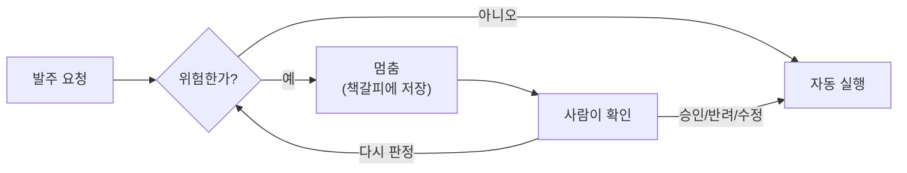

# N044 실습 설명자료 — 사람이 승인하는 에이전트 만들기(HITL)

> 오늘 진행한 N044 강의와 실습(재고 자동 발주 승인 에이전트)을 논리적으로 상세히 풀어 정리한 문서. 강의의 취지, 실습이 검증하려는 것, 실제로 한 작업, 향후 적용법, 동료에게 설명하는 법 순으로 구성했다.
>
> 💡 **읽는 법**: 이 문서는 코드를 몰라도 끝까지 읽을 수 있게 썼다. 어려운 용어가 나오면 그 자리에서 바로 비유로 풀어준다. 그래도 "여기부터는 개발자용"이라고 표시된 부분은 건너뛰어도 전체 줄거리를 이해하는 데 지장 없다.

## 미리 보는 용어 4개

이 문서에 계속 나오는 용어 4개를 먼저 한 번에 익히고 시작하면 편하다. 나중에 본문에서 다시 만나면 아래 비유를 떠올리면 된다.

| 용어 | 무엇을 하는가 | 비유 |
|---|---|---|
| **interrupt (멈춤)** | 위험한 순간에 AI가 실행을 멈추고 사람에게 화면을 띄운다 | 은행 창구 직원이 "이건 제가 결정할 수 없어서 팀장님께 여쭤볼게요"라며 잠깐 손을 멈추는 것 |
| **checkpointer (책갈피)** | 멈춘 시점까지 진행 상황을 저장해둔다 | 책을 읽다 말고 꽂아두는 책갈피 — 나중에 정확히 그 페이지부터 다시 읽을 수 있다 |
| **thread_id (대기번호표)** | 여러 요청이 동시에 대기 중일 때 서로 안 섞이게 구분한다 | 은행 창구의 대기번호표 — "3번 손님 업무를 계속하세요" |
| **resume (재개)** | 사람이 답을 하면, 멈췄던 곳부터 다시 이어서 실행한다 | 책갈피를 보고 "127페이지부터 이어 읽으면 된다"고 확인하는 것 |

---

## 목차
1. [이 수업(N044)의 취지 — 왜 지금 이 주제인가](#1)
2. [실습이 알아보고자 한 것 — 무엇을 "확인"하려는 실습인가](#2)
3. [우리가 실제로 한 작업 (순서대로)](#3)
4. [앞으로 내 프로젝트에 어떻게 적용하면 되는가](#4)
5. [동료에게 어떻게 설명하면 되는가](#5)
6. [용어 사전](#6)

---

## 1. 이 수업(N044)의 취지 — 왜 지금 이 주제인가

지금까지 아이펠 수업에서 만든 자동화들(뉴스레터 에이전트, 고객응대 에이전트, 카드뉴스 에이전트 등)은 전부 "결과물을 만드는 것까지"였습니다. 문서를 요약하고, 답변을 만들고, 이미지를 생성하고 — 여기까지는 AI가 실수해도 사람이 확인하고 버리면 그만입니다.

그런데 실무의 마지막 한 걸음은 다릅니다: 그 결과물을 **실제로 내보내는 순간**입니다. 환불금을 계좌로 쏘거나, 발주서를 거래처에 전송하거나, 답변을 고객에게 발송하는 순간 — 이건 되돌릴 수 없습니다. 아무리 AI 정확도를 99%까지 끌어올려도, 하루 처리량이 많으면 그 1%가 매일 몇 건씩 사고로 쌓입니다. 즉 "정확도를 올리는 문제"와 "안전한 문제"는 서로 다른 축이라는 게 이 수업의 첫 번째 통찰입니다.

이 문제 앞에 선택지는 셋뿐입니다:

| 선택지 | 결과 |
|---|---|
| 전부 사람이 확인 | 안전하지만, 사람이 다 봐야 하니 자동화의 의미가 없다 |
| 전부 자동 | 빠르지만, 반드시 사고가 몇 건씩 남는다 |
| **위험한 것만 사람이 확인 = HITL** | 빠르면서도 위험은 막는다 |

셋 중 실무에서 유일하게 실용적인 답이 HITL(Human-in-the-Loop, 사람이 고리 안에 있다는 뜻)이고, 이게 오늘 배운 주제입니다.

## 2. 실습이 알아보고자 한 것 — 무엇을 "확인"하려는 실습인가

강의는 이론만 설명하고 끝나지 않고, 이걸 코드로 구현할 때 실제로 무엇이 필요한지 앞서 소개한 4가지 부품(**멈춤·책갈피·대기번호표·재개**)으로 쪼개 가르쳐줍니다. 그런데 이론과 실제 구현 사이엔 함정이 하나 있습니다.

> ⚠️ **오늘 강의가 가장 강조한 함정**: "재개(다시 이어감)는 멈춘 지점부터 이어가는 게 아니라, 멈춘 단계 전체를 처음부터 다시 실행한다."

책갈피 비유로 다시 설명하면 이렇습니다 — 보통의 책갈피는 "127페이지 어디쯤"이 아니라 "이 챕터를 처음부터 다시 읽어라"라고 말하는 조금 이상한 책갈피인 셈입니다. 이걸 모르고 코드를 짜면 어떤 일이 생기냐면: "고객님 요청을 검토 중입니다"라는 문자를 멈추기 **전에** 보내도록 짰다가, 사람이 승인 버튼을 누르는 순간 그 챕터(단계) 전체가 재실행되면서 **같은 문자가 두 번 나가는 사고**가 납니다.

이 실습의 목적은 정확히 이겁니다: **"이 함정이 실제 코드에서 어떤 모습으로 나타나는지, 그리고 어떻게 피하는지"를 직접 손으로 만들어 몸으로 확인하는 것.** 판정 로직(무엇을 자동 승인할지)의 정확도는 이 실습의 핵심이 아닙니다 — 그래서 저희는 일부러 규칙 기반(숫자 비교 두 줄)으로만 판정하고, AI(LLM) 호출을 아예 안 썼습니다. AI를 안 써도 이 안전장치 자체는 완전하게 만들 수 있다는 걸 보여주고 싶었기 때문입니다.

## 3. 우리가 실제로 한 작업 (순서대로)

1. **주제 선정**: "재고 자동 발주 승인" — 강의가 든 예시 주제 중 하나를 골라, 발주액·수량이라는 순수 숫자 기준으로 위험을 판정하게 설계했습니다. (환불은 강의 예제와 겹쳐서 프로젝트 주제에서 제외되어 있었습니다.)
2. **Colab vs 로컬 결정**: 이 실습은 그래픽카드(GPU)도 AI 사용료도 필요 없었고(규칙 기반 판정), 오히려 "컴퓨터를 껐다 켜도 대기 중이던 승인 건이 안 사라지는가"가 핵심 확인 포인트였습니다. Colab(구글이 빌려주는 임시 컴퓨터)은 접속이 끊기면 저장해둔 파일(책갈피 역할을 하는 파일)이 통째로 사라지므로 이 실습 목적에 정면으로 안 맞았습니다 → 로컬(내 컴퓨터) 선택.
3. **흐름 설계**: `요청 접수 → 판정 → (위험하면) 멈춤 → 사람 응답 대기 → 재개 → 실행` 흐름을 짜고, 파일 하나에 책갈피를 저장하는 방식(SqliteSaver)을 붙였습니다.
4. **승인 화면 제작**: "10초 안에 판단 가능한 화면"(강의가 요구한 5요소: 원본 요청·핵심 수치·AI 판정 근거·멈춘 이유·통과시키면 벌어질 일)과 4가지 응답 버튼(승인/수정후승인/반려/다시판정)을 만들었습니다.
5. **10건의 가상 데이터로 실행 → 실제 화면 클릭으로 확인**: 자동승인 5건, 대기 5건이 정확히 갈리는지 확인하고, 4가지 버튼을 전부 실제로 눌러봤습니다.
6. **여기서 실제 버그를 만나고 고쳤습니다** — 이게 이 실습의 가장 값진 부분입니다.

   > 🔧 여기부터는 살짝 기술적인 이야기입니다. 굵은 글씨 문장만 따라가도 전체 줄거리는 이해할 수 있습니다.

   - "다시 판정" 버튼(조건 하나를 예외로 봐주고 다시 계산하는 기능)을 처음엔 한 곳에서 반복해서 멈추도록 짰습니다.
   - 실행해보니 **두 번째 멈춤이 이상하게 동작했습니다** — 분명 "이번엔 예외로 통과시켜라"라는 메모를 남겨뒀는데, 다음 단계에서 그 메모가 사라져 있었습니다.
   - 원인을 추적해보니: 이 프로그램은 "이 프로그램이 기억해야 할 항목들"을 미리 적어둔 표(상태 스키마)를 하나 갖고 있는데, **한 단계에서 다음 단계로 넘어갈 때 그 표에 적혀 있는 항목만 전달됩니다.** 저는 "이번엔 예외로 봐준다"는 임시 메모를 그 표에 적어두는 걸 깜빡했습니다. 그래서 방금 만든 값이 그 자리에서는 멀쩡히 보였지만, 다음 단계로 넘어가면서 조용히 사라진 것이었습니다.
   - 고친 방법: 한 곳에서 반복해서 멈추는 대신, "다시 판정"을 누르면 **판정하는 단계 자체로 되돌아가게** 구조를 바꿨습니다. 이렇게 하면 한 번 지나갈 때마다 최대 한 번만 멈추므로, 이 문제 자체가 원천적으로 생기지 않습니다.
7. **REPORT.md 작성**: 강의가 요구한 6항목(주제·이유 / 구조도 / 승인기준·이유 / 실행결과 / 데모설계 / 회고)을 전부 채웠고, 이번에 겪은 버그와 해결 과정을 회고에 그대로 남겼습니다.

## 4. 앞으로 내 프로젝트에 어떻게 적용하면 되는가

### 누구나 알아야 할 원칙

- **"되돌릴 수 없는 마지막 단계"가 있는 자동화라면 무조건 HITL을 검토하세요** — 이메일 발송, 결제, 배포, 게시처럼 한 번 나가면 못 무르는 지점이 있다면, 딱 그 한 곳에만 "멈춤" 장치를 넣으면 됩니다. 자동화 전체를 다시 만들 필요는 없습니다.
- **멈추는 기준을 만들 때는 항상 "모호한 말 → 숫자로 잴 수 있는 규칙"으로 바꾸세요.** "이상해 보이면 멈춰"가 아니라 "이 금액이 이 숫자를 넘으면 멈춰"로. 그리고 그 기준이 실제로 잘 작동하는지 반드시 확인하세요 — 오늘 실습에서도 경계값 하나(정확히 2배인 경우) 때문에 실제로 놓친 건이 하나 나왔습니다. 기준을 세우는 것과, 그 기준이 옳은지 확인하는 것은 별개의 일입니다.
- **"멈춤" 이전에는 절대 되돌릴 수 없는 일(문자 발송, 결제 등)을 하지 마세요.** 다시 이어갈 때 그 단계 전체가 처음부터 다시 실행되기 때문에, 중복으로 실행됩니다.
- **대기 상태가 있는 무언가를 만들 땐 임시 메모리가 아니라 파일이나 데이터베이스에 저장하세요** — 컴퓨터를 껐다 켜도 대기 건이 남아있어야 진짜 쓸 수 있는 시스템입니다.

### 개발자용 체크리스트 (코드를 직접 짤 때만 해당)

- 노드 사이에서 주고받을 모든 값은 상태 스키마(TypedDict)에 미리 선언한다 — "여기서만 잠깐 쓰는 값이니 안 적어도 되겠지"라는 생각이 오늘 겪은 버그의 원인이었다.
- 같은 노드로 되돌아가는 반복(재시도·재판정) 로직은 노드 안 반복문이 아니라 그래프의 조건부 엣지로 구현한다 — 노드 하나당 `interrupt()`는 최대 한 번만 호출되게.
- `InMemorySaver`가 아니라 `SqliteSaver` 등 파일/DB 기반 체크포인터를 쓴다.

## 5. 동료에게 어떻게 설명하면 되는가

**한 줄 엘리베이터 피치**:
> "AI가 자동으로 처리하되, 돈이 나가거나 되돌릴 수 없는 순간에만 딱 멈춰서 사람 승인을 받고 이어가는 '안전벨트'를 만들어봤어요. 재고 발주를 예로 들면, 100만원 넘거나 평소보다 2배 넘게 시키면 자동으로 멈추고, 나머진 그냥 통과시키는 식이에요."

**좀 더 풀어서 설명할 때 순서**:
1. "지금까지 만든 자동화는 결과를 만드는 것까지였는데, 그걸 실제로 내보내는 마지막 단계는 사고 위험이 있어서 따로 다뤄야 해요." (문제의식)
2. "그래서 HITL이라는 패턴을 씁니다 — 전부 사람이 보거나 전부 자동으로 하는 대신, 위험한 것만 골라서 사람한테 넘기는 거예요." (해법)
3. "핵심은 4가지예요: 멈추는 것, 멈춘 지점을 책갈피처럼 저장하는 것, 여러 요청이 안 섞이게 대기번호표를 주는 것, 사람 답을 받아 이어가는 것." (구조)
4. "제일 중요한 함정은, '이어간다'는 게 멈춘 지점부터가 아니라 그 단계를 처음부터 다시 돌리는 거라는 점이에요. 그래서 멈추기 전에 되돌릴 수 없는 일(문자 보내기 같은)을 하면 안 돼요." (핵심 원칙)
5. "저는 이걸로 재고 발주 승인 데모를 만들었는데, 만드는 중에 실제로 이 문제와 관련된 버그를 만났어요 — 메모 하나를 표에 안 적어놨더니 다음 단계로 안 넘어가더라고요. 이걸 고치면서 원리를 훨씬 확실히 이해했어요." (경험을 통한 설득력)
6. "결과물은 화면에서 눌러볼 수 있는 데모로 볼 수 있고, 코드는 150줄 안쪽이에요 — AI 호출 하나 없이 규칙만으로 짰는데도 안전장치 구조 자체는 완전하게 재현했습니다." (규모감·범위 명시)

이 순서로 말하면 "왜 필요한지 → 어떻게 작동하는지 → 실제로 뭘 겪었는지"가 자연스럽게 이어져서, 기술을 모르는 동료에게도 설득력 있게 전달됩니다.

## 6. 용어 사전

| 용어 | 쉬운 설명 |
|---|---|
| HITL (Human-in-the-Loop) | 위험한 순간에만 사람이 끼어들게 만든 자동화 설계 |
| interrupt (멈춤) | 프로그램이 실행을 멈추고 사람에게 판단을 넘기는 동작 |
| resume (재개) | 사람의 답을 받아 멈췄던 단계를 다시 실행하는 동작 |
| checkpointer (책갈피) | 멈춘 시점까지의 진행 상황을 저장해두는 장치 |
| thread_id (대기번호표) | 여러 요청이 섞이지 않게 구분하는 고유 번호 |
| 개입률 | 전체 요청 중 사람에게 넘어온 비율 |
| 놓침 (Miss) | 사람이 봤어야 하는데 자동으로 처리되어버린 건 (가장 위험한 실수) |
| 헛멈춤 (False Positive) | 안 봐도 됐는데 사람에게 넘어온 건 (비효율이지만 덜 위험) |
